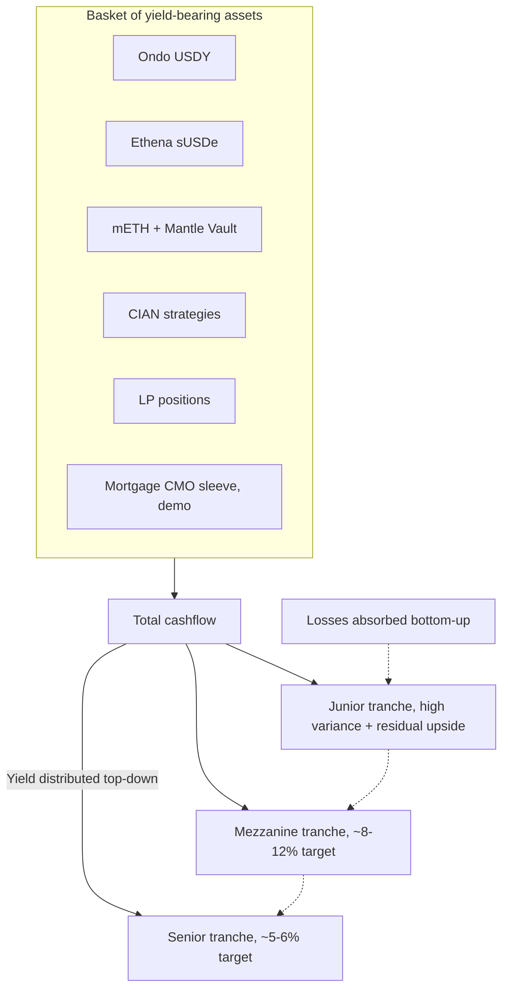
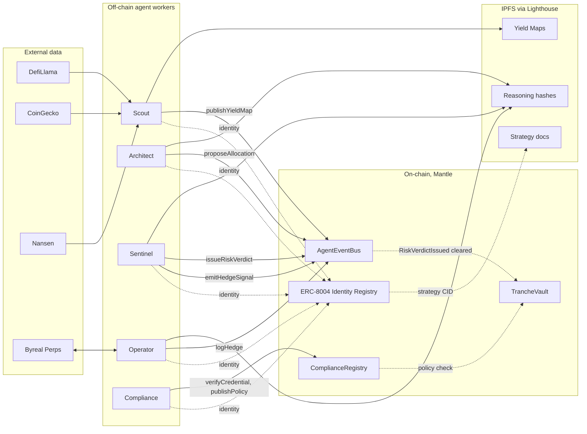
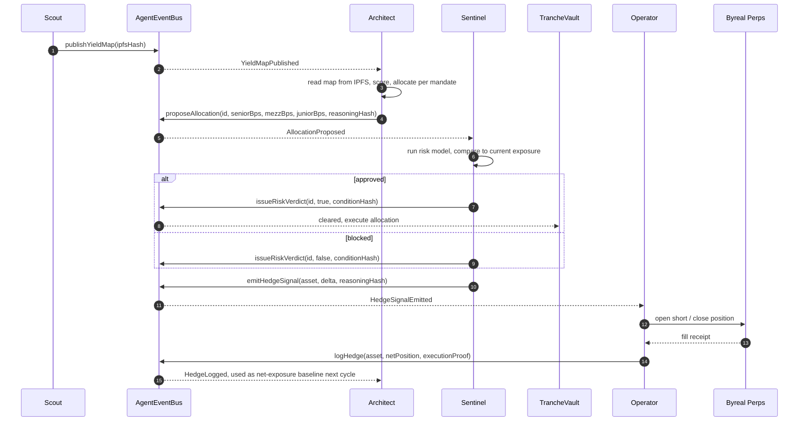
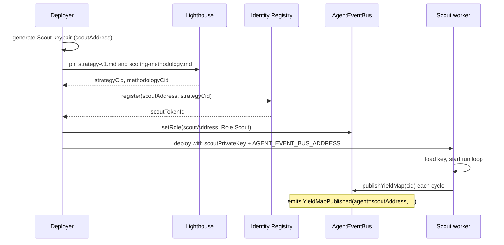
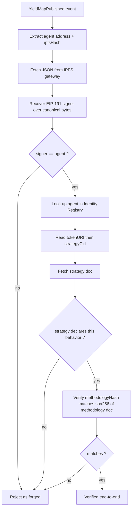
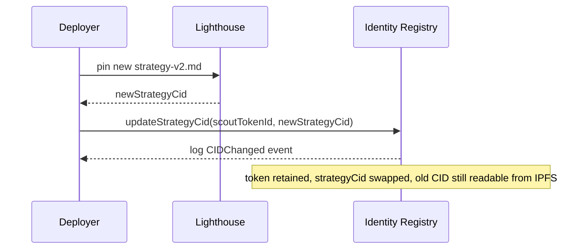
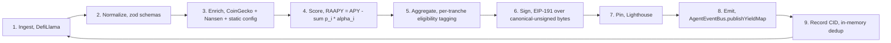

# Strata

Tranched real-world-asset yield on Mantle, managed end-to-end by five autonomous agents with on-chain identities, verifiable decisions, and a typed event bus connecting them.

Mantle Turing Test Hackathon 2026 submission. Target tracks: AI x RWA (First Prize) and Grand Champion.

## The product in one line

One pool of yield, sliced into three tiers. Pick the tier that fits your risk. Watch every move the protocol makes on-chain.

## How the cashflow is split

Senior takes yield first and absorbs loss last. Junior takes yield last and absorbs loss first. Mezzanine sits in between.



Each tranche is its own ERC-20. You self-select into the one that matches your risk appetite and regulatory context.

## System architecture

Five off-chain agents do the work an asset manager, a risk desk, a hedging desk, and a compliance officer would do in a traditional shop. They communicate through one shared on-chain event bus. Capital lives in a separate vault contract that only acts on cleared proposals.



## The five agents

| # | Agent | Job | Reads | Emits |
|---|---|---|---|---|
| 1 | Scout | Yield sourcing | DefiLlama, CoinGecko, Nansen | `YieldMapPublished` |
| 2 | Architect | Portfolio construction | `YieldMapPublished`, `HedgeLogged` | `AllocationProposed` |
| 3 | Sentinel | Risk gate, macro signals | `AllocationProposed`, oracle feeds | `RiskVerdictIssued`, `HedgeSignalEmitted` |
| 4 | Operator | Byreal Perps hedging | `HedgeSignalEmitted` | `HedgeLogged` |
| 5 | Compliance | Deposit-gate, policy NFTs | zkPass / Privado, sanctions oracles | `ComplianceVerified`, `PolicyUpdated` (on `ComplianceRegistry`) |

Scout, Architect, Sentinel, Operator all emit through the same `AgentEventBus` contract. Compliance lives on its own registry because its lifecycle is the deposit boundary, not the rebalancing loop.

## How one full loop runs



Every step in the loop is an on-chain event with a CID pointing to either the input data (Scout's map) or the reasoning that produced the decision (Architect's allocation rationale, Sentinel's risk model snapshot, Operator's fill receipt). The full trail is queryable, citable, and reusable.

## ERC-8004 identity

ERC-8004 is the agent identity standard. Three pieces, all on Mantle:

1. **Identity Registry**: one NFT per agent, bound to the agent's signing address. Token metadata points to an IPFS doc declaring capabilities and the current strategy CID.
2. **Reputation Registry**: append-only attestations about agent behavior. Other actors (other agents, indexers) submit signed claims that reference an agent's tokenId.
3. **Validation Registry** (optional, v2): independent validators stake claims. Not used in v1; the on-chain event log is the validation source.

### Bootstrap, per agent



The address that emits events is the same address that owns the identity NFT. The bus enforces "only Role.Scout can call publishYieldMap." The chain glues identity to authorship without any off-chain trust.

### Verification chain, per event

Anyone reading a published map can replay these five steps to confirm it came from the registered agent under its declared rules.



If all four match-points succeed, the artifact was produced by the registered agent under its declared strategy. You can audit the protocol the same way you'd audit a smart contract, just with one extra IPFS hop.

### Updating a strategy



The chain log of `updateStrategyCid` calls is the strategy's version history. No identity churn.

### Reputation

For v1, reputation is read-only metadata accrued by indexers reading the bus log. Counters per agent: maps published, proposals submitted, verdicts cleared vs. blocked, hedge fills logged, depeg events caught. When a Mantle protocol wants to subscribe to Sentinel as a reusable risk oracle, the on-chain track record is what they're buying. That's the long arc.

In v2, attestations become explicit calls into the Reputation Registry: `attest(tokenId, kind, value, sig)`. We don't need that yet.

## Scout's pipeline, the one that's built today

Scout is the reference agent implementation in this repo. The other four follow the same shape, scoped to their job. Scout's cycle, every 60 seconds:



Every stage is deterministic given its inputs. Failures are isolated (one source down, others continue). Missing enrichment fields drop `confidence` rather than getting filled with optimistic defaults.

Full Scout docs: [`agents/scout/README.md`](agents/scout/README.md). Agent-system docs: [`agents/README.md`](agents/README.md). The complete scoring methodology, with the math and worked examples: [`agents/scout/docs/scoring-methodology.md`](agents/scout/docs/scoring-methodology.md).

## External integrations, locked at four

| Service | Purpose | Auth |
|---|---|---|
| DefiLlama | Yield universe (APY + TVL across all Mantle pools) | None |
| CoinGecko | 365d daily price for depeg analysis | Demo API key |
| Nansen | Smart-money holders, fresh-wallet inflows, wash-trade flags | Paid API key |
| Lighthouse | IPFS pin for maps, strategies, reasoning hashes | API key |

Plus Mantle RPC for emit and read. Nothing else. Mantlescan, Ondo API, Ethena API, CIAN API, Pinata, web3.storage, 1inch, Odos, Allora, OraKle, Agni/Merchant Moe subgraphs are all explicitly out of scope. The fewer keys we manage, the fewer rate limits to hit and the simpler the demo story.

## Repository layout

```text
strata/
  agents/
    README.md                # agent system overview + listener pattern + ERC-8004 details
    scout/                   # agent 1, yield sourcing, fully built
      README.md
      docs/
        strategy-v1.md       # pinned to IPFS, linked from identity NFT
        scoring-methodology.md
      src/
      tests/                 # 62 vitest tests
      scripts/
    architect/               # agent 2, next up
    sentinel/                # agent 3, next up
    operator/                # agent 4, next up
    compliance/              # agent 5, next up
  apps/
    web/                     # Next.js 14 landing + dashboard (in progress)
  docs/
    superpowers/plans/       # implementation plans
  product.md                 # the product spec
```

The contracts live in a sibling repo owned by the contracts engineer. This repo is the off-chain side: agent workers, the frontend, plans, docs.

## Quickstart

```bash
pnpm install
pnpm --filter @strata/scout build
pnpm --filter @strata/scout test
```

To run Scout against a live network you need API keys and a deployed `AgentEventBus`. See [`agents/scout/README.md`](agents/scout/README.md#environment) for the env vars and bootstrap order.

## Status

- **Scout** (agent 1): off-chain pipeline complete. 62 unit tests passing. Ingestion, enrichment, scoring, aggregation, signing, IPFS pin, on-chain publish wrapper, run loop, health, metrics all done. Waiting on the contracts engineer to deploy `AgentEventBus` and the Identity Registry to wire the live integration.
- **Architect, Sentinel, Operator, Compliance**: not yet started. Each one mirrors Scout's structure (canonical schemas, zod-validated boundaries, ERC-8004 identity wiring, IPFS-anchored strategy doc).
- **Frontend**: design handoff received. Next.js 14 landing in progress.
- **Contracts**: owned by separate engineer. `IAgentEventBus.sol` interface and design rules locked in (string hashes, one shared bus, role-gated emit-only, ComplianceRegistry separate).

## License and disclaimers

Not investment advice. The mortgage CMO sleeve in the Junior tranche is a labeled demo, seeded with realistic prepayment behavior for stress testing. Real RWA integrations come in v2.

For demo day, the Transparency Dashboard is the centerpiece: one full agent loop, end-to-end, in 30 seconds.
