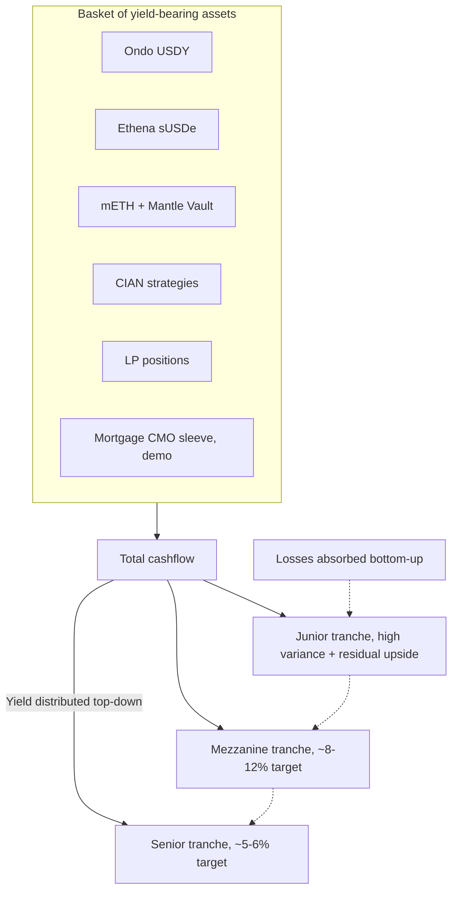
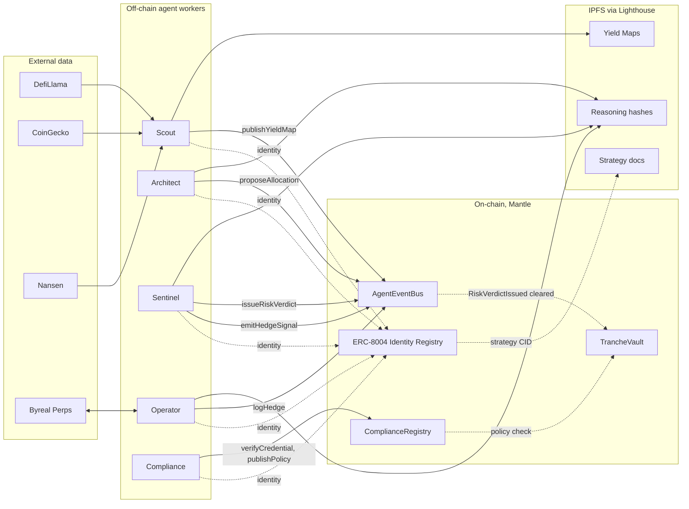
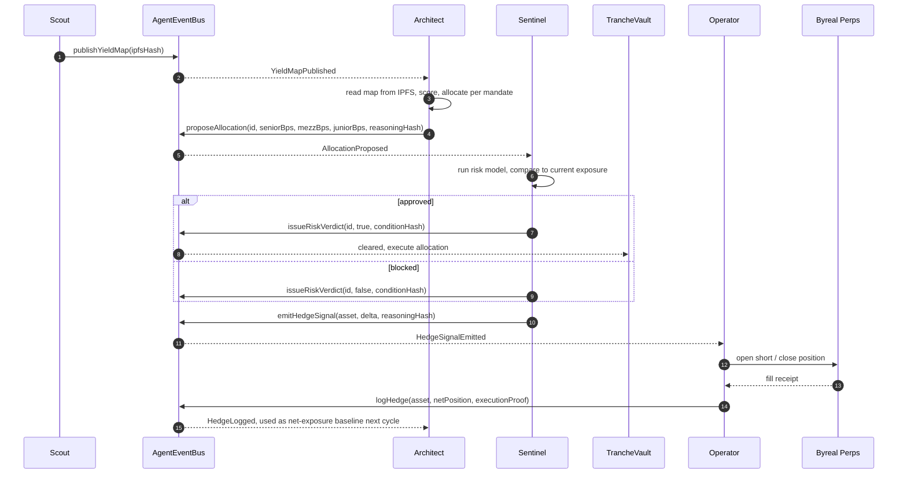
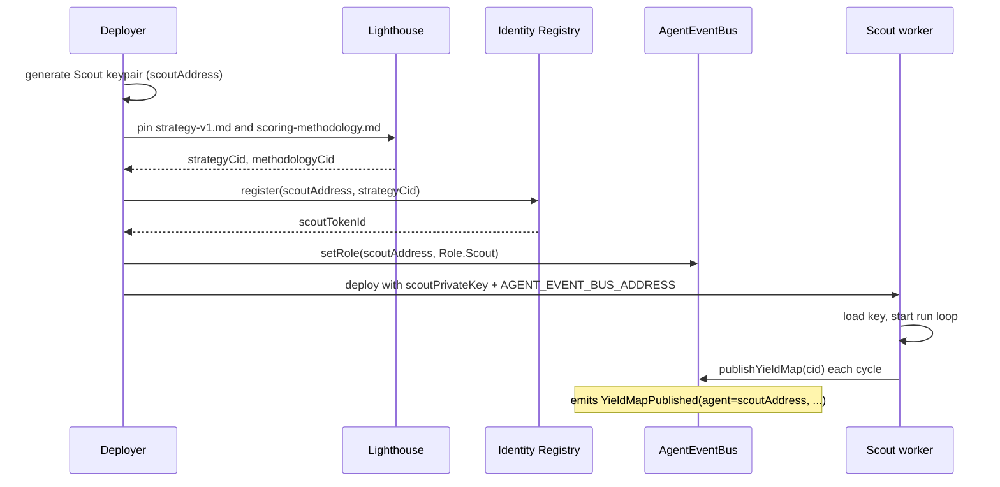
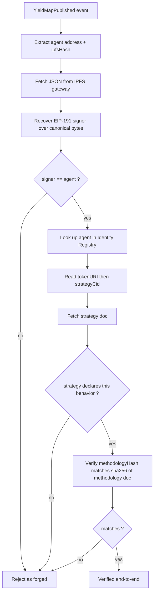
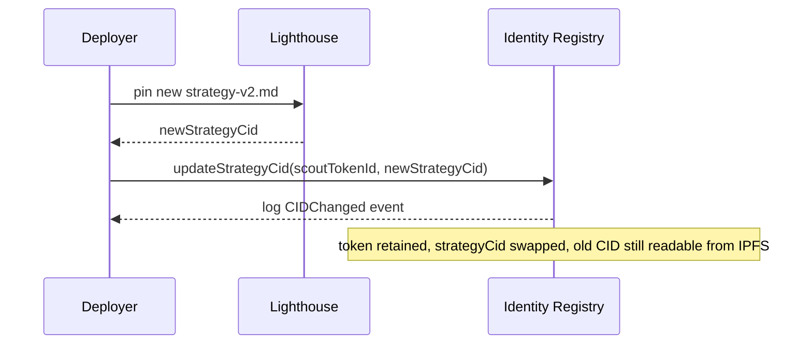
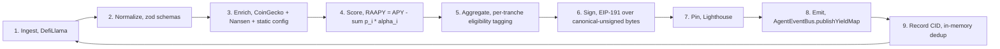

# Strata

Tranched real-world-asset yield on Mantle, managed end-to-end by five autonomous agents with on-chain identities, verifiable decisions, and a typed event bus connecting them.

Mantle Turing Test Hackathon 2026 submission. Target tracks: AI x RWA (First Prize) and Grand Champion.

## The product in one line

One pool of yield, sliced into three tiers. Pick the tier that fits your risk. Watch every move the protocol makes on-chain.

## How the cashflow is split

Senior takes yield first and absorbs loss last. Junior takes yield last and absorbs loss first. Mezzanine sits in between.



Each tranche is its own ERC-20. You self-select into the one that matches your risk appetite and regulatory context.

## System architecture

Five off-chain agents do the work an asset manager, a risk desk, a hedging desk, and a compliance officer would do in a traditional shop. They communicate through one shared on-chain event bus. Capital lives in a separate vault contract that only acts on cleared proposals.



## The five agents

| # | Agent | Job | Reads | Emits |
|---|---|---|---|---|
| 1 | Scout | Yield sourcing | DefiLlama, CoinGecko, Nansen | `YieldMapPublished` |
| 2 | Architect | Portfolio construction | `YieldMapPublished`, `HedgeLogged` | `AllocationProposed` |
| 3 | Sentinel | Risk gate, macro signals | `AllocationProposed`, oracle feeds | `RiskVerdictIssued`, `HedgeSignalEmitted` |
| 4 | Operator | Byreal Perps hedging | `HedgeSignalEmitted` | `HedgeLogged` |
| 5 | Compliance | Deposit-gate, policy NFTs | zkPass / Privado, sanctions oracles | `ComplianceVerified`, `PolicyUpdated` (on `ComplianceRegistry`) |

Scout, Architect, Sentinel, Operator all emit through the same `AgentEventBus` contract. Compliance lives on its own registry because its lifecycle is the deposit boundary, not the rebalancing loop.

## How one full loop runs



Every step in the loop is an on-chain event with a CID pointing to either the input data (Scout's map) or the reasoning that produced the decision (Architect's allocation rationale, Sentinel's risk model snapshot, Operator's fill receipt). The full trail is queryable, citable, and reusable.

## ERC-8004 identity

ERC-8004 is the agent identity standard. Three pieces, all on Mantle:

1. **Identity Registry**: one NFT per agent, bound to the agent's signing address. Token metadata points to an IPFS doc declaring capabilities and the current strategy CID.
2. **Reputation Registry**: append-only attestations about agent behavior. Other actors (other agents, indexers) submit signed claims that reference an agent's tokenId.
3. **Validation Registry** (optional, v2): independent validators stake claims. Not used in v1; the on-chain event log is the validation source.

### Bootstrap, per agent



The address that emits events is the same address that owns the identity NFT. The bus enforces "only Role.Scout can call publishYieldMap." The chain glues identity to authorship without any off-chain trust.

### Verification chain, per event

Anyone reading a published map can replay these five steps to confirm it came from the registered agent under its declared rules.



If all four match-points succeed, the artifact was produced by the registered agent under its declared strategy. You can audit the protocol the same way you'd audit a smart contract, just with one extra IPFS hop.

### Updating a strategy



The chain log of `updateStrategyCid` calls is the strategy's version history. No identity churn.

### Reputation

For v1, reputation is read-only metadata accrued by indexers reading the bus log. Counters per agent: maps published, proposals submitted, verdicts cleared vs. blocked, hedge fills logged, depeg events caught. When a Mantle protocol wants to subscribe to Sentinel as a reusable risk oracle, the on-chain track record is what they're buying. That's the long arc.

In v2, attestations become explicit calls into the Reputation Registry: `attest(tokenId, kind, value, sig)`. We don't need that yet.

## Scout's pipeline, the one that's built today

Scout is the reference agent implementation in this repo. The other four follow the same shape, scoped to their job. Scout's cycle, every 60 seconds:



Every stage is deterministic given its inputs. Failures are isolated (one source down, others continue). Missing enrichment fields drop `confidence` rather than getting filled with optimistic defaults.

Full Scout docs: [`agents/scout/README.md`](agents/scout/README.md). Agent-system docs: [`agents/README.md`](agents/README.md). The complete scoring methodology, with the math and worked examples: [`agents/scout/docs/scoring-methodology.md`](agents/scout/docs/scoring-methodology.md).

## External integrations, locked at four

| Service | Purpose | Auth |
|---|---|---|
| DefiLlama | Yield universe (APY + TVL across all Mantle pools) | None |
| CoinGecko | 365d daily price for depeg analysis | Demo API key |
| Nansen | Smart-money holders, fresh-wallet inflows, wash-trade flags | Paid API key |
| Lighthouse | IPFS pin for maps, strategies, reasoning hashes | API key |

Plus Mantle RPC for emit and read. Nothing else. Mantlescan, Ondo API, Ethena API, CIAN API, Pinata, web3.storage, 1inch, Odos, Allora, OraKle, Agni/Merchant Moe subgraphs are all explicitly out of scope. The fewer keys we manage, the fewer rate limits to hit and the simpler the demo story.

## Repository layout

```text
strata/
  agents/
    README.md                # agent system overview + listener pattern + ERC-8004 details
    scout/                   # agent 1, yield sourcing, fully built
      README.md
      docs/
        strategy-v1.md       # pinned to IPFS, linked from identity NFT
        scoring-methodology.md
      src/
      tests/                 # 62 vitest tests
      scripts/
    architect/               # agent 2, next up
    sentinel/                # agent 3, next up
    operator/                # agent 4, next up
    compliance/              # agent 5, next up
  apps/
    web/                     # Next.js 14 landing + dashboard (in progress)
  docs/
    superpowers/plans/       # implementation plans
  product.md                 # the product spec
```

The contracts live in a sibling repo owned by the contracts engineer. This repo is the off-chain side: agent workers, the frontend, plans, docs.

## Quickstart

```bash
pnpm install
pnpm --filter @strata/scout build
pnpm --filter @strata/scout test
```

To run Scout against a live network you need API keys and a deployed `AgentEventBus`. See [`agents/scout/README.md`](agents/scout/README.md#environment) for the env vars and bootstrap order.

## Deployed contracts (Mantle mainnet, chain 5000)

Broadcast 2026-06-04 from deployer `0x6Bce…7355`. Full deployment artifact at [`contracts/deployments/5000.json`](contracts/deployments/5000.json).

| Contract | Address | Purpose |
|---|---|---|
| AgentEventBus | [`0x0E6F30bC…0D0A62`](https://mantlescan.xyz/address/0x0E6F30bC6D9b08cD20d422D634d565d3300D0A62) | Role-gated emitter shared by all 4 rebalancing agents |
| TrancheController | [`0xF65C36F0…BCecA`](https://mantlescan.xyz/address/0xF65C36F0a8DB43edAb9d70Ab7eec025eA61BCecA) | USDC custodian, runs the harvest waterfall |
| ComplianceRegistry | [`0x0481bE75…E7550`](https://mantlescan.xyz/address/0x0481bE75687b3d4daAc6fc0ED2c3b51DC85E7550) | EIP-712 verifier-signed soulbound receipts |
| ERC-8004 Identity Registry | [`0x8004A169…9a432`](https://mantlescan.xyz/address/0x8004A169FB4a3325136EB29fA0ceB6D2e539a432) | One identity NFT per agent (#101–#105) |
| Senior Vault (sSTRATA) | [`0x7B70cd25…aAA5db`](https://mantlescan.xyz/address/0x7B70cd25c86E10F144f5D73A94f7F22c20aAA5db) | ERC-4626, first on yield, last on loss |
| Mezzanine Vault (mSTRATA) | [`0xa076cF50…5be37C`](https://mantlescan.xyz/address/0xa076cF50656621BdcB5e4a8bfc991294615be37C) | ERC-4626, balanced exposure |
| Junior Vault (jSTRATA) | [`0xCaedb62e…ACc2F`](https://mantlescan.xyz/address/0xCaedb62edC3C49Fe9c1A2F77c307fE92844ACc2F) | ERC-4626, residual upside, first loss |
| Aave V3 USDC adapter | [`0xd8E4A25e…959a7`](https://mantlescan.xyz/address/0xd8E4A25eab6de5D504E0A53d9Daec3687B3959a7) | Senior + Mezz, trustless |
| Ondo USDY adapter | [`0x0CDaea95…5Ba9b`](https://mantlescan.xyz/address/0x0CDaea9582CF886Df9E359fD2435B86c9415Ba9b) | Senior, oracle-valued |
| mETH adapter | [`0xd526DD02…F2be`](https://mantlescan.xyz/address/0xd526DD02366F9DA22232Ed8cDD1db197bc51F2be) | Mezz, Chainlink-valued, FX-labeled |
| Ethena sUSDe adapter | [`0xfA824066…480663`](https://mantlescan.xyz/address/0xfA8240669B9fC8A697F1595d7ceAe9e81c480663) | Mezz + Junior, peg-clamped |
| Agni LP adapter | [`0x755D0BA6…879F2`](https://mantlescan.xyz/address/0x755D0BA62C10dae194091F395c96E9d14CF879F2) | Junior, full-range V3 NFT |
| Perp basis escrow | [`0x55F90908…d3f32`](https://mantlescan.xyz/address/0x55F90908eFe0E8e78a4CDE445d57a1EDB26d3f32) | Junior, operator-reported hedge value |
| USDC (Mantle) | [`0x09Bc4E0D…0D0dF9`](https://mantlescan.xyz/address/0x09Bc4E0D864854c6aFB6eB9A9cdF58aC190D0dF9) | Underlying for all tranches |

## Agent wallets (Mantle mainnet)

Each agent owns one ERC-8004 identity NFT and the matching role on `AgentEventBus`. Wallets are funded with MNT for gas; rebalancing transactions never move user funds, only emit events. Compliance is on the registry, not the bus.

| Agent | Token | Wallet | Role grant tx |
|---|---|---|---|
| Scout | #101 | [`0x7CAC071f…fcdE`](https://mantlescan.xyz/address/0x7CAC071f0F59dEe64509ea1C3BD8245bE529fcdE) | [`0x7b00fa8a…f6ed0`](https://mantlescan.xyz/tx/0x7b00fa8a8ad101964d05e2834cf0165cbf89f237103d83422e383bbb722f6ed0) |
| Architect | #102 | [`0xbFDb8d13…De714`](https://mantlescan.xyz/address/0xbFDb8d132358b2f46D3104Ef484048Bb916De714) | [`0x56906777…9bd53`](https://mantlescan.xyz/tx/0x5690677701ca4ed036343e551f6c05d24f0640b59b5d425cd33fff394899bd53) |
| Sentinel | #103 | [`0xfE7EB190…708f`](https://mantlescan.xyz/address/0xfE7EB19092F03E00B6eD0a248D38E80e0aA8708f) | [`0x3c4a3ee8…418e`](https://mantlescan.xyz/tx/0x3c4a3ee8e8e1e6cf1f6c563a66f0cfcb6fbfd8f00fb6177ac3a8bd0e234a418e) |
| Operator | #104 | [`0xB342B41A…519E`](https://mantlescan.xyz/address/0xB342B41A68a3c6C36Efb8f224CDd252F90aD519E) | [`0x9fbbbc5a…50b37`](https://mantlescan.xyz/tx/0x9fbbbc5a8ec71051fb562ed370eaef20d69e79bfc28ad7c030679963b3650b37) |
| Compliance | #105 | [`0x59767a3E…CA628`](https://mantlescan.xyz/address/0x59767a3E91998A07D11aBE13CD460Fa3249CA628) | EIP-712 verifier of `ComplianceRegistry` |

### Seed cycles (2026-06-04, mainnet)

Three full rebalance cycles ran end-to-end. Each agent's pinned doc differs cycle-to-cycle, so all 19 CIDs and JSON bodies are distinct. These are exactly the transactions the 24h Railway cron reproduces in production.

**Cycle 1 — baseline (Senior 60 / Mezz 30 / Junior 10)**

| Step | Agent | Tx | CID |
|---|---|---|---|
| 1 | Scout publishes Yield Map v1 | [`0x4f2a1bf4…ded33`](https://mantlescan.xyz/tx/0x4f2a1bf4e0821ebb3d9ef224ad0423fea89eea6c43a6243dd738ef8b9c6ded33) | `QmTMcLP2…Zjt1s` |
| 2 | Architect proposes allocation #1780589901 | [`0xc4e23f8b…79970`](https://mantlescan.xyz/tx/0xc4e23f8b2cb889c2abbce09ad7957f902be37ed8e300807ccedc2d28b6679970) | `QmTr1ekp…dQzyD` |
| 3 | Sentinel issues verdict CLEAR | [`0x91250f67…761db`](https://mantlescan.xyz/tx/0x91250f676098d64e1d6b749f3aac0742ccf0f99c8c5538b6981edb43bd5761db) | `QmY73bjz…tdgez` |
| 4 | Sentinel rates Senior · USDC = Green | [`0x1d05ee86…f0e4`](https://mantlescan.xyz/tx/0x1d05ee86ac141ef23225711d657cf756add26c807ea5bec95fc03ebb7f44f0e4) | `QmPnpTBi…QvSL` |
| 5 | Sentinel emits hedge signal #1 ($1k) | [`0x92080627…83119`](https://mantlescan.xyz/tx/0x92080627f6e50ab4beee83339eedd124550bf52427277fc608ab57eea7383119) | `Qma6GLpM…1nPvU` |
| 6 | Operator fills signal #1 (-$500 net) | [`0x63b12b2e…9ee6`](https://mantlescan.xyz/tx/0x63b12b2e40933ffc446ded47a0bfa899f4da4fe98d58f374194b5b3b219e9ee6) | `QmUcwKAk…eYxv` |
| 7 | Compliance claims soulbound receipt #1 | [`0x3657ec9f…583e4`](https://mantlescan.xyz/tx/0x3657ec9f1a6121fe6d48b0d19a4cc316a07d3c275e96021a516a3a70768583e4) | `QmUEVWAM…hDgX` |

**Cycle 2 — sUSDe leads, tilt to mezz (Senior 55 / Mezz 35 / Junior 10)**

| Step | Agent | Tx | CID |
|---|---|---|---|
| 1 | Scout publishes Yield Map v2 (sUSDe leads) | [`0x636bf573…ce688`](https://mantlescan.xyz/tx/0x636bf573b020c512bedfbe88307e4cfef891123958478d545b15edfeb8ace688) | `QmNuvY6M…m5B5` |
| 2 | Architect proposes allocation #1780594730 | [`0x47021e64…08cc5`](https://mantlescan.xyz/tx/0x47021e647758e54aa2a44064b480383c0c75c6b27fa7b225c4cfc05305808cc5) | `Qmf32dWj…toWsV` |
| 3 | Sentinel issues verdict CLEAR (all green) | [`0xb66c0a90…52ea8`](https://mantlescan.xyz/tx/0xb66c0a90f34052e2189993ead17fc744ebf5e2cabaa9e12476e90c654c952ea8) | `QmdqN8Lp…okVe` |
| 4 | Sentinel rates Mezzanine · USDC = Green | [`0xe5e86f05…be3ec`](https://mantlescan.xyz/tx/0xe5e86f053e5b76a271259a284078f322cf7e31e50ab4ce440922c6ced5dbe3ec) | `QmUXBXBm…NaZgU` |
| 5 | Sentinel emits hedge signal #2 ($2k) | [`0x1aa09fab…bd873`](https://mantlescan.xyz/tx/0x1aa09fabdd67a475bf8836064835b3d92c466ae215c8276fd8d50a51472bd873) | `QmQzvmcL…jBTWV` |
| 6 | Operator fills signal #2 (-$1k net) | [`0xea01bfaa…659df`](https://mantlescan.xyz/tx/0xea01bfaa26fa43092a1f6d73b5bb0071ba3999b93167294ded1946ef087659df) | `QmZ1DT4M…VDMn` |

**Cycle 3 — USDY spike, tilt to senior, junior BLOCKED (Senior 65 / Mezz 25 / Junior 10)**

| Step | Agent | Tx | CID |
|---|---|---|---|
| 1 | Scout publishes Yield Map v3 (USDY leads) | [`0xc08decd3…1653d`](https://mantlescan.xyz/tx/0xc08decd3321d4379c41f592dd93902b4e3a564f09738d1fc8cdee3afdce1653d) | `QmXtvdoP…kvAi3` |
| 2 | Architect proposes allocation #1780594769 | [`0xdf04a33a…7463b`](https://mantlescan.xyz/tx/0xdf04a33aebbc5d9ade92421caf00d37e787b70b194bb52551f269b7f2d37463b) | `QmQcbFuw…yo5h` |
| 3 | Sentinel issues verdict BLOCKED | [`0xb7184d42…d65d1`](https://mantlescan.xyz/tx/0xb7184d42418a4f6034c6ce8d7b4dfe0ffbffe0f124395270389edc1e5b5d65d1) | `QmPme4H5…hcao` |
| 4 | Sentinel rates Junior · USDC = Red | [`0x375e5b9b…03a82`](https://mantlescan.xyz/tx/0x375e5b9b04b8f3a0c1a06d72fbace8a1418c5d8ddc9ab022ade10e8c94003a82) | `QmYfNfXK…JUZ1` |
| 5 | Sentinel emits hedge signal #3 ($500, defensive) | [`0x9b97a02a…27237`](https://mantlescan.xyz/tx/0x9b97a02a236d853c35be2806dacb068351e2c8854cf6a5af4909df3019927237) | `QmR8uFMZ…v7Py` |
| 6 | Operator trims signal #3 (-$125 residual) | [`0xecbb2ecf…61ad99`](https://mantlescan.xyz/tx/0xecbb2ecffa19e4ee319db7b5b7d89af6d597fcbab235531cf4849d8ca861ad99) | `QmaUqxZu…RBw6` |

Mirror: [`agents/.demo-seed.json`](agents/.demo-seed.json). All 19 CIDs are listed in [`apps/web/src/lib/realEvents.ts`](apps/web/src/lib/realEvents.ts).

## Running an agent cycle

```bash
# one-off cycle of agent X (same command the 24h cron will run)
pnpm --filter @strata/scout      demo
pnpm --filter @strata/architect  demo   # waits up to 10 min for Scout's tx, then proposes
pnpm --filter @strata/sentinel   demo   # waits for Architect, then verdict + rating + hedge signal
pnpm --filter @strata/operator   demo   # waits for Sentinel, then logs hedge fill
pnpm --filter @strata/compliance demo   # standalone, signs + claims receipt
```

Each cycle prints one structured JSON line per stage: `pinned` (Lighthouse CID), `tx-mined` (mantlescan URL). The full sequence above completes in well under 5 minutes.

## Status

- **Contracts**: live on Mantle mainnet. Bus + controller + 3 tranche vaults + 6 adapters + compliance registry + ERC-8004 identity registry all deployed and verified.
- **All five agents**: live on mainnet, signed strategies pinned to Lighthouse, role-grants in place, one full demo cycle landed end-to-end.
- **Frontend**: Next.js 14 app live at [`apps/web`](apps/web). Landing + KYC/deposit flow + agent dashboard reads real Mantle data (TVL via ERC-4626 `totalAssets`, activity from the static seed above, IPFS doc viewer in the Documents tab).
- **Compliance**: registry deployed, verifier wallet active, one demo receipt minted. Privado / zkPass plumbing is the next pass.

## License and disclaimers

Not investment advice. The mortgage CMO sleeve in the Junior tranche is a labeled demo, seeded with realistic prepayment behavior for stress testing. Real RWA integrations come in v2.

For demo day, the Transparency Dashboard is the centerpiece: one full agent loop, end-to-end, in 30 seconds.
