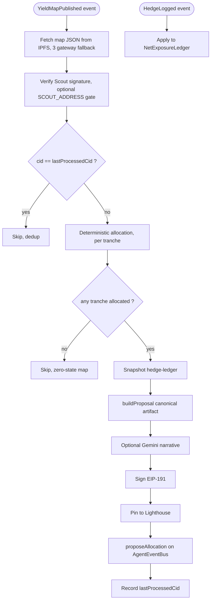

# Architect

The allocation agent for Strata. Architect subscribes to Scout's `YieldMapPublished` events on `AgentEventBus`, verifies the map's signature, runs a deterministic score-weighted allocation across the three tranches, and publishes a signed `AllocationProposal` to IPFS with an on-chain pointer. Architect owns no capital and cannot execute. Every proposal is gated by Sentinel's `RiskVerdictIssued` before TrancheVault unlocks funds.

For the system-level picture (all five agents, the event bus, ERC-8004 identity), see [`../README.md`](../README.md).

## Status

80 unit tests passing. Off-chain pipeline is feature complete: subscribe, fetch, verify, allocate, build, sign, pin, on-chain emit, hedge-ledger snapshot, run loop, health, metrics, optional Gemini narrative. The full-chain integration smoke waits on the coworker to deploy `AgentEventBus` with role grants.

## Quickstart

```bash
# from repo root
pnpm install
pnpm --filter @strata/architect build
pnpm --filter @strata/architect test
```

To run a single cycle off-chain against a real Scout-pinned YieldMap CID:

```bash
pnpm --filter @strata/architect inspect --cid <yieldMapCid>
cat agents/architect/proposal-output.md
```

The inspect script forces `ARCHITECT_DRY_RUN=true`, pins the clock at `1_700_000_000_000`, and uses an ephemeral key so the output is reproducible for manual review.

## The cycle, end to end

Event-driven. No polling timers. Two subscriptions, one orchestrator.



## What Architect does, in order

1. **Subscribe.** `YieldMapPublished` triggers a new proposal cycle. `HedgeLogged` updates the in-memory net-exposure ledger continuously; the ledger is snapshotted at proposal time and embedded in the artifact.

2. **Fetch.** Pull the YieldMap JSON by CID. Three-gateway fallback: Lighthouse, then ipfs.io, then dweb.link. 10s timeout per gateway. Schema-validate with `YieldMapSchema` from `@strata/scout/types`.

3. **Verify.** Recompute `mapHash = keccak256(canonicalStringify({...map, signature: ""}))`. Recover EIP-191 signer. Assert `signer === map.publisher.address`. When `SCOUT_ADDRESS` is set in env, also assert `signer === SCOUT_ADDRESS`. Fail closed: any mismatch increments `architect_verification_failures` and the cycle is skipped.

4. **Allocate.** Run the deterministic two-phase algorithm in [`docs/allocation-methodology.md`](docs/allocation-methodology.md). Phase 1: per-tranche score-weighted normalization with concentration caps and overflow redistribution. Phase 2: cross-tranche normalization of present tranches to sum to exactly 10000 bps. Constants live in `ALLOCATION_CONSTANTS` and their sha256 (via the methodology doc) is stamped on every proposal as `methodologyHash`.

5. **Build.** `proposalId = uint256(keccak256(sourceMapCid + '|' + publishedAtMs))`. Compose the `AllocationProposal` artifact with `tranches`, `netExposureAtProposalMs`, `methodologyHash`, `codeCommit`, `narrative: null`.

6. **Narrative (optional).** If `GEMINI_API_KEY` is set, Gemini fills `narrative` with a short human-readable rationale. The allocation math is unaffected. Without the key, `narrative` stays `null`.

7. **Sign.** Canonical-stringify the draft with `signature: ''`, hash, EIP-191 sign with the Architect key.

8. **Pin.** Upload to Lighthouse with two retries. Returns the CID.

9. **Emit.** Call `AgentEventBus.proposeAllocation(proposalId, seniorBps, mezzBps, juniorBps, reasoningHash=cid)` from the Architect-roled account. Definitive reverts use `AbortError` and are not retried.

## Allocation methodology, in one paragraph

For each tranche, eligible opportunities are sorted by score descending, score-weighted to bps with floor, capped at the per-tranche concentration limit (`{senior: 6000, mezzanine: 4000, junior: 2500}`), overflow redistributed iteratively to uncapped positions, and the rounding-leftover topped up to the highest-score sub-cap position. Then tranche shares (`{senior: 5000, mezzanine: 3000, junior: 2000}`) are renormalized across present tranches so the three add to exactly 10000 bps. The full derivation lives in [`docs/allocation-methodology.md`](docs/allocation-methodology.md).

## Replayability

Anyone with the source code at `codeCommit`, the methodology doc whose sha256 matches `methodologyHash`, and the source YieldMap at `sourceMapCid` can reproduce the bps. `publishedAtMs` and `signature` differ between live and replay; the inspect script pins both for byte-stable local inspection.

## File layout

```
agents/architect/
  src/
    chain/client.ts                 viem PublicClient + WalletClient
    config.ts                       zod env loader
    types.ts                        AllocationProposal schema
    ipfs/fetch.ts                   gateway fallback
    verify/yieldMap.ts              EIP-191 recover + Scout-address gate
    subscription/yieldMap.ts        YieldMapPublished subscriber
    subscription/hedgeLog.ts        HedgeLogged subscriber
    pipeline/netExposure.ts         per-asset ledger
    pipeline/allocate.ts            deterministic per-tranche math
    pipeline/buildProposal.ts       canonical artifact composer
    pipeline/orchestrator.ts        runProposalCycle with dedup
    publication/onchain.ts          proposeAllocation wrapper, AbortError on revert
    publication/publish.ts          sign + pin + emit
    publication/abi/agentEventBus.ts
    llm/gemini.ts + llm/narrative.ts  optional narrative layer
    monitor/health.ts + monitor/metrics.ts
    runLoop.ts
    index.ts                        live entrypoint
  docs/
    strategy-v1.md
    allocation-methodology.md       sha256 = methodologyHash
  scripts/
    inspect-allocation.ts
    upload-strategy.ts
  tests/unit/
```

## Environment

| Variable | Required | Default | Notes |
|---|---|---|---|
| `MANTLE_RPC_URL` | yes | | Primary RPC |
| `MANTLE_RPC_URL_FALLBACK` | no | `https://mantle.publicgoods.network` | Second leg of viem fallback transport |
| `ARCHITECT_PRIVATE_KEY` | yes | | 0x-prefixed 32-byte hex |
| `ARCHITECT_DRY_RUN` | no | `false` | When `true`, skips the on-chain emit and runs sign + pin only |
| `AGENT_EVENT_BUS_ADDRESS` | live only | | Required when dryRun is false |
| `IDENTITY_REGISTRY_ADDRESS` | reserved | | For a future on-chain registry lookup; not read today |
| `SCOUT_ADDRESS` | no | | When set, verifier requires recovered signer to equal this in addition to publisher.address |
| `LIGHTHOUSE_API_KEY` | yes | | For pinning the signed proposal |
| `ARCHITECT_HEALTH_PORT` | no | `9091` | `/healthz` + `/metrics` HTTP server |
| `ARCHITECT_IDENTITY_NFT` | no | `ipfs://placeholder` | Recorded on the proposal |
| `GEMINI_API_KEY` | optional | | Enables Task 16 narrative |
| `GEMINI_MODEL` | no | `gemini-2.5-flash` | Used only when GEMINI_API_KEY is set |
| `LOG_LEVEL` | no | `info` | pino level |
| `CYCLE_INTERVAL_MS` | reserved | `60000` | Not read by the event-driven loop today |

## Failure modes

| Cause | Behavior |
|---|---|
| IPFS fetch fails after gateway fallback | Skip cycle, metric `architect_verification_failures_total`, wait for next event |
| Map signature invalid | Skip + log + metric |
| Zero-allocation map (no eligible opportunities) | Skip on-chain emit (publishing zero would misrepresent state) |
| Lighthouse pin fails after retries | Skip on-chain emit |
| On-chain tx reverts | Not retried (`AbortError`); definitive contract rejection |

## Operations

- `pnpm --filter @strata/architect dev` to run the live loop.
- `pnpm --filter @strata/architect inspect --cid <cid>` for a single off-chain cycle that writes `proposal-output.md`.
- `tsx agents/architect/scripts/upload-strategy.ts` to pin both docs to Lighthouse and print the `{strategyCid, methodologyCid, methodologyHash}` triple for the coworker to record on Architect's ERC-8004 identity NFT via `IERC8004Identity.updateStrategyCid`.
- `/healthz` returns `{status: 'ok', lastProposalAt}`; `/metrics` exposes prom-format counters and gauges.
