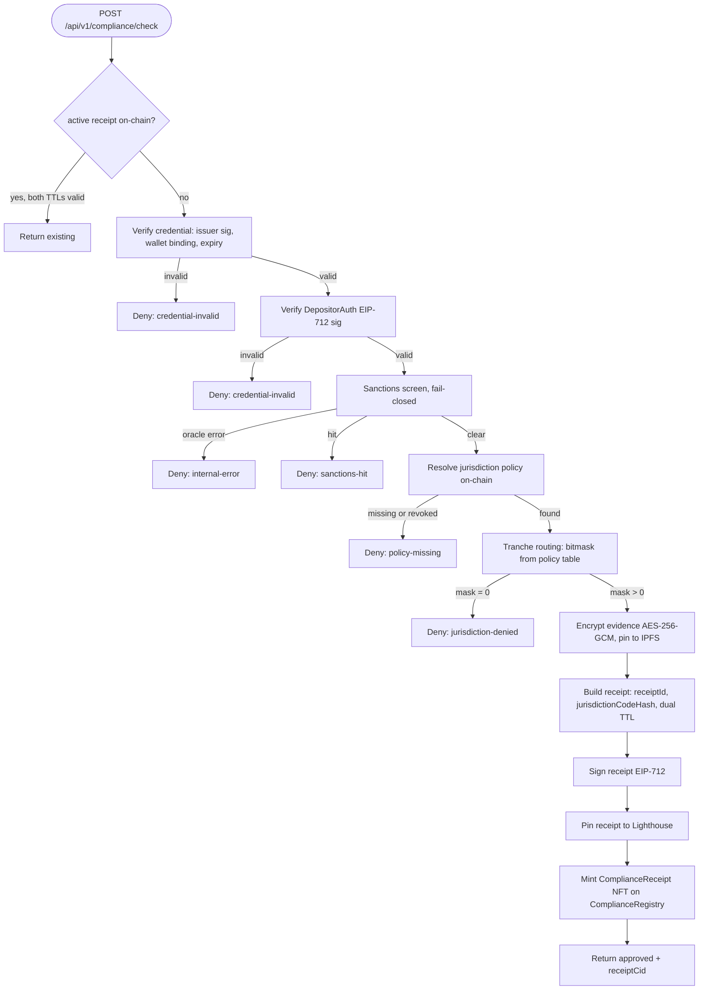

# Compliance

The deposit-gate agent for Strata. Compliance verifies depositor credentials, screens wallets against a sanctions oracle, resolves the applicable jurisdiction policy on-chain, routes the depositor to permitted tranches via a deterministic lookup table, encrypts all evidence with AES-256-GCM, signs an EIP-712 receipt, pins it to IPFS, and mints a ComplianceReceipt NFT on the ComplianceRegistry. Compliance never imports AI and never makes judgment calls. Every path either produces a signed receipt or returns a typed denial. The gate is perpendicular to the rebalance loop: it runs on depositor demand, not on Architect's cycle.

For the system-level picture (all five agents, the event bus, ERC-8004 identity), see [`../README.md`](../README.md).

## Status

Off-chain pipeline is feature complete: credential verification, sanctions screening, policy resolution, tranche routing, evidence encryption, receipt building, EIP-712 signing, IPFS pinning, on-chain minting, HTTP API, health, metrics. Smoke-tested: entrypoint boots cleanly, `/healthz` and `/metrics` serve. The on-chain integration smoke waits on the coworker's deployment of `ComplianceRegistry`, `JurisdictionPolicyNFT`, `PolicyRevocationRegistry`, and `Role.Compliance` grant on `AgentEventBus`.

## Quickstart

```bash
# from repo root
pnpm install
pnpm --filter @strata/compliance build
pnpm --filter @strata/compliance test
```

To run a full gate cycle off-chain with stub adapters and hardcoded test data:

```bash
pnpm --filter @strata/compliance inspect
cat agents/compliance/compliance-output.md
```

The inspect script forces `COMPLIANCE_DRY_RUN=true`, pins the clock at `1_700_000_000` (seconds), and uses an ephemeral key (Hardhat account #1).

## The gate cycle, end to end

Request-driven. Each `POST /api/v1/compliance/check` triggers one gate cycle.



## What the gate does, in order

1. **Check existing.** Read `ComplianceRegistry.activeReceipt(wallet)`. If both `kycExpiresAtSec` and `sanctionsScreenExpiresAtSec` are in the future, return `existing` immediately. No new receipt is minted.

2. **Verify credential.** The credential is an EIP-712 signed struct from a recognized issuer. The adapter checks: wallet binding (proof.wallet == request wallet), expiry (expiresAtSec > now), issuer signature recovery, and issuer address match. v1 uses a stub adapter with Hardhat account #0 as the test issuer. v2 swaps in zkPass or Privado ID.

3. **Verify DepositorAuth.** The depositor signs `DepositorAuth(wallet, credentialEvidenceHash, deadline)` with EIP-712 over domain `StrataCompliance/1/5000`. The gate recovers the signer and asserts it matches the wallet. If the deadline has passed, the auth is rejected.

4. **Screen sanctions.** Call the sanctions oracle. v1 uses a stub with a hardcoded denylist (two addresses). v2 uses Chainalysis. The oracle returns `{ clear, screenedAtSec, resultHash }`. If the oracle throws, the gate denies with `internal-error` (fail-closed). If `clear === false`, denied with `sanctions-hit`. The screen has a 24-hour TTL.

5. **Resolve policy.** Look up the jurisdiction policy for the depositor's `jurisdictionCode`. v1 stub: in-memory map with 4 policies (US, EU, GB, permissionless). Live: read `JurisdictionPolicyNFT.activePolicyFor(keccak256(code))`, check revocation on `PolicyRevocationRegistry`, fetch the policy JSON from IPFS.

6. **Route tranches.** Read `policy.permittedTranchesByKycTier[kycTier]` to get the bitmask (bit 0 = senior, bit 1 = mezzanine, bit 2 = junior). If sanctions are not clear, mask is 0. If mask is 0, denied with `jurisdiction-denied`.

7. **Encrypt evidence.** Generate a 32-byte AES key per receipt. Serialize the credential proof, sanctions screen, jurisdiction code, and KYC tier into a JSON payload. Encrypt with AES-256-GCM (12-byte IV, 16-byte auth tag). Pin the encrypted blob to Lighthouse. Pin the sanctions screen metadata separately.

8. **Build receipt.** `receiptId = uint256(keccak256(abi.encodePacked(wallet, credentialEvidenceHash, policyTokenId, sanctionsScreenCid)))`. `jurisdictionCodeHash = keccak256(abi.encodePacked(jurisdictionCode, salt))`, default salt is 32 zero bytes. Dual TTL: `kycExpiresAtSec = now + KYC_TTL[tier]`, `sanctionsScreenExpiresAtSec = now + 86400`.

9. **Sign.** EIP-712 sign the receipt with the Compliance agent key. Domain `StrataCompliance/1/5000`, type `ComplianceReceipt`. This is EIP-712 (typed structured data), not EIP-191.

10. **Pin + mint.** Pin the signed receipt JSON to Lighthouse. If not dry-run, call `ComplianceRegistry.mintComplianceReceipt(wallet, policyTokenId, mask, kycExp, sanctionsExp, tokenURI)`. Reverts throw `AbortError`.

## Policy publishing flow

A separate binary (`compliance-publisher`) manages jurisdiction policy NFTs on the `JurisdictionPolicyNFT` contract. In v1 this is a placeholder. In v2, the publisher will read regulatory source text, run an AI interpreter to propose permission tables, collect multisig approvals via Safe, and mint/update policy NFTs.

## Replayability

Anyone with the source at `codeCommit`, [`docs/compliance-methodology.md`](docs/compliance-methodology.md) whose sha256 matches `methodologyHash`, the credential proof, the sanctions screen result, and the policy state at `policyResolvedAtBlock` can reproduce the receipt. Two fields differ in live runs: `publishedAtSec` and `signature`.

## File layout

```
agents/compliance/
  src/
    chain/client.ts                  viem PublicClient + WalletClient
    chain/onchain.ts                 mintComplianceReceipt, refreshSanctionsScreen, readActiveReceipt
    chain/abi/complianceRegistry.ts
    chain/abi/jurisdictionPolicyNft.ts
    chain/abi/policyRevocationRegistry.ts
    config.ts                        zod env loader
    types.ts                         ComplianceReceipt, DenialRecord, JurisdictionPolicy schemas
    adapters/credential.ts           CredentialAdapter interface
    adapters/stubCredential.ts       stub issuer (Hardhat #0), EIP-712 signed test credentials
    adapters/sanctions.ts            SanctionsOracle interface
    adapters/stubSanctions.ts        hardcoded denylist
    pipeline/policyResolver.ts       stub + live policy resolution
    pipeline/trancheRouter.ts        deterministic bitmask routing
    pipeline/evidence.ts             AES-256-GCM encrypt/decrypt, wire format
    pipeline/buildReceipt.ts         receipt composition, receiptId derivation, dual TTL
    pipeline/gateOrchestrator.ts     runGateCycle with all steps
    signing/eip712.ts                DepositorAuth + ComplianceReceipt EIP-712 signing/verification
    publication/publish.ts           sign + pin + mint
    api/server.ts                    Fastify HTTP API
    monitor/health.ts + monitor/metrics.ts
    gate.ts                          live entrypoint (compliance-gate binary)
    publisher.ts                     policy publisher entrypoint (compliance-publisher binary)
  docs/
    strategy-v1.md
    compliance-methodology.md        sha256 = methodologyHash
  scripts/
    inspect-compliance.ts
    upload-strategy.ts
  tests/unit/
```

## Environment

| Variable | Required | Default | Notes |
|---|---|---|---|
| `MANTLE_RPC_URL` | yes | | Primary RPC |
| `MANTLE_RPC_URL_FALLBACK` | no | `https://mantle.publicgoods.network` | viem fallback transport |
| `COMPLIANCE_PRIVATE_KEY` | yes | | 0x-prefixed 32-byte hex |
| `COMPLIANCE_DRY_RUN` | no | `false` | When true, skips on-chain mint |
| `COMPLIANCE_REGISTRY_ADDRESS` | live only | | Required when dryRun is false |
| `JURISDICTION_POLICY_NFT_ADDRESS` | live only | | Required when dryRun is false |
| `POLICY_REVOCATION_REGISTRY_ADDRESS` | live only | | Required when dryRun is false |
| `LIGHTHOUSE_API_KEY` | yes | | For pinning receipts and evidence |
| `COMPLIANCE_HEALTH_PORT` | no | `9094` | `/healthz` + `/metrics` HTTP server |
| `COMPLIANCE_IDENTITY_NFT` | no | `ipfs://placeholder` | Recorded on the receipt |
| `LOG_LEVEL` | no | `info` | pino level |

## Failure modes

| Cause | Behavior |
|---|---|
| Credential signature invalid | Deny `credential-invalid` + `compliance_verification_failures_total` |
| Credential expired | Deny `credential-invalid` |
| DepositorAuth signature mismatch | Deny `credential-invalid` |
| DepositorAuth deadline passed | Deny `credential-invalid` |
| Sanctions oracle unreachable | Deny `internal-error` (fail-closed) |
| Sanctions hit | Deny `sanctions-hit` + `compliance_denials_total` |
| Jurisdiction policy missing | Deny `policy-missing` |
| Jurisdiction policy revoked | Deny `policy-missing` |
| KYC tier yields zero tranche mask | Deny `jurisdiction-denied` |
| Lighthouse pin fails | Cycle aborts before on-chain mint |
| On-chain tx reverts | `AbortError`, not retried |

## Operations

- `pnpm --filter @strata/compliance dev:gate` to run the gate server.
- `pnpm --filter @strata/compliance inspect` for an off-chain gate cycle that writes `compliance-output.md`.
- `tsx agents/compliance/scripts/upload-strategy.ts` pins `strategy-v1.md` + `compliance-methodology.md` to Lighthouse and prints `{strategyCid, methodologyCid, methodologyHash}` for the coworker to record on Compliance's ERC-8004 identity NFT.
- `/healthz` returns `{status: 'ok', lastReceiptAt, lastDenialAt}`; `/metrics` exposes `compliance_checks_total`, `compliance_receipts_total`, `compliance_denials_total`, `compliance_verification_failures_total`, `compliance_sanctions_screens_total`, `compliance_last_receipt_ms`.
