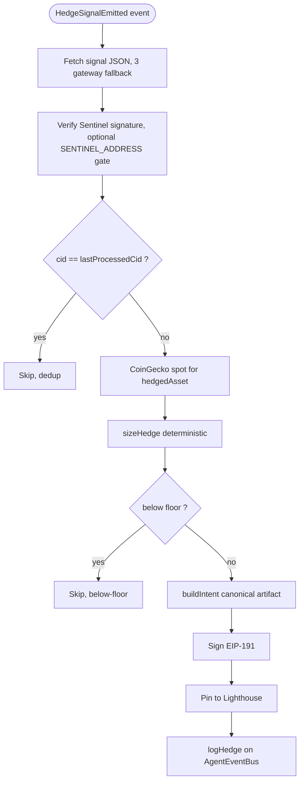

# Operator

The hedging agent for Strata. Operator subscribes to Sentinel's `HedgeSignalEmitted` events on `AgentEventBus`, verifies the signal's signature, fetches the asset's USD spot from CoinGecko, runs a deterministic sizing algorithm, signs a `HedgeIntent` artifact pinned to IPFS, and emits `HedgeLogged` with the signed intent as the on-chain `executionProof`.

For v1 (this hackathon), Operator is a **paper-trading executor**: it never touches a real perp exchange. The signed `HedgeIntent` documents what Operator *would* have traded. v2 swaps in a real fill adapter (Byreal Perps) and replaces the IPFS proof with a real fill receipt. The hackathon deliverable is the verifiable on-chain chain (Sentinel signal → Operator intent → on-chain log), not the trade itself.

For the system-level picture (all five agents, the event bus, ERC-8004 identity), see [`../README.md`](../README.md).

## Status

17 unit tests passing. Off-chain pipeline is feature complete: subscribe, fetch, verify, fetch spot, size, build, sign, pin, on-chain emit, event-driven run loop, health, metrics. Smoke-tested: entrypoint boots cleanly, `/healthz` and `/metrics` serve. The on-chain integration smoke waits on the coworker's `AgentEventBus` deployment with `HedgeSignalEmitted` event, `HedgeLogged` event, and `Role.Operator`.

## Quickstart

```bash
# from repo root
pnpm install
pnpm --filter @strata/operator build
pnpm --filter @strata/operator test
```

To replay one cycle off-chain against a real Sentinel-pinned signal CID:

```bash
export COINGECKO_API_KEY=...   # demo-tier is fine
pnpm --filter @strata/operator inspect --signal-cid <signalCid> [--block <n>]
cat agents/operator/hedge-output.md
```

The inspect script forces `OPERATOR_DRY_RUN=true`, pins the clock at `1_700_000_000_000`, and uses an ephemeral key.

## The cycle, end to end

Event-driven. One subscription, one orchestrator.



## What Operator does, in order

1. **Subscribe.** `HedgeSignalEmitted` triggers a hedge cycle. The `reasoningHash` field is the IPFS CID of Sentinel's signed signal blob.

2. **Fetch.** Pull the signal JSON by CID with three-gateway fallback (Lighthouse, ipfs.io, dweb.link), 10s timeout. Schema-validate the `HedgeSignal` shape before any logic runs.

3. **Verify.** Recompute `keccak256(canonicalStringify({...signal, signature: ''}))`. Recover EIP-191 signer. Assert it matches `signal.publisher.address`. When `SENTINEL_ADDRESS` is set, the recovered signer must also equal that address.

4. **Spot.** Fetch USD price for `signal.hedgedAsset` from CoinGecko `/simple/token_price/mantle?contract_addresses=<addr>&vs_currencies=usd&x_cg_demo_api_key=<key>`. 10s timeout, AbortController. Throws if the response has no price.

5. **Size.** Run the deterministic sizing algorithm in [`docs/hedge-methodology.md`](docs/hedge-methodology.md). `HEDGE_CONSTANTS`:
   - `minNotionalUsd = 10_000` (signals below this skip with reason `below-floor`)
   - `maxNotionalUsd = 5_000_000` (clamped, sign preserved)
   - `slippageToleranceBps = 50` (descriptive in the intent, not enforced)
   - `overshootBps = 0` (v1: hedge exactly the requested notional)

   Sign convention: positive `targetNotionalUsd` from Sentinel means the protocol is long the asset and needs to **short** to neutralize. Negative → **long**.

6. **Build.** `intentId = uint256(keccak256(sourceSignalCid + '|' + sourceSignalBlock))`. Compose the `HedgeIntent` artifact with `direction`, `notionalUsd`, `contractSize = notionalUsd / spotPriceUsd`, `spotPriceUsd`, `spotPriceTimestampMs`, `slippageToleranceBps`, `methodologyHash`, `codeCommit`.

7. **Sign + pin + emit.** Canonical-stringify with `signature: ''`, hash, EIP-191 sign with the Operator key. Pin to Lighthouse. Convert notional to 6-decimal USDC units: `netPosition = BigInt(round(notionalUsd * 1_000_000))` (signed). Emit `logHedge(hedgedAsset, netPosition, executionProof=cid)`.

## Why no real perp execution in v1

Strata is locked to four external data integrations: DefiLlama, CoinGecko, Nansen, Lighthouse. Byreal Perps is not on that list, and adding it would expand the hackathon scope past where the team has bandwidth. v1's signed-intent paper trades preserve the full verifiable chain (Sentinel → Operator → on-chain) and make v2's real-fill upgrade a contained adapter swap.

## Replayability

Anyone with the source at `codeCommit`, [`docs/hedge-methodology.md`](docs/hedge-methodology.md) whose sha256 matches `methodologyHash`, the source signal at `sourceSignalCid`, and the CoinGecko spot at `spotPriceTimestampMs` can reproduce the intent. v1 sizing uses `Number(notional) / spotPriceUsd` (float64) for `contractSize`; v2 switches to fixed-point for byte-stable replays. `publishedAtMs` and `signature` differ between live and replay.

## File layout

```
agents/operator/
  src/
    chain/client.ts                viem PublicClient + WalletClient
    config.ts                      zod env loader
    types.ts                       HedgeIntent schema
    ipfs/fetch.ts                  HedgeSignal fetcher
    verify/hedgeSignal.ts          Sentinel EIP-191 verifier
    market/coingecko.ts            spot price lookup
    subscription/hedgeSignal.ts    HedgeSignalEmitted subscriber
    pipeline/sizeHedge.ts          deterministic sizing
    pipeline/buildIntent.ts        canonical artifact composer
    pipeline/orchestrator.ts       runHedgeCycle with dedup
    publication/onchain.ts         logHedge wrapper, AbortError on revert
    publication/publish.ts         sign + pin + emit
    publication/abi/agentEventBus.ts
    monitor/health.ts + monitor/metrics.ts
    runLoop.ts
    index.ts                       live entrypoint
  docs/
    strategy-v1.md
    hedge-methodology.md           sha256 = methodologyHash
  scripts/
    inspect-hedge.ts
    upload-strategy.ts
  tests/unit/
```

## Environment

| Variable | Required | Default | Notes |
|---|---|---|---|
| `MANTLE_RPC_URL` | yes | | Primary RPC |
| `MANTLE_RPC_URL_FALLBACK` | no | `https://mantle.publicgoods.network` | viem fallback transport |
| `OPERATOR_PRIVATE_KEY` | yes | | 0x-prefixed 32-byte hex |
| `OPERATOR_DRY_RUN` | no | `false` | When true, skips on-chain emit |
| `AGENT_EVENT_BUS_ADDRESS` | live only | | Required when dryRun is false |
| `IDENTITY_REGISTRY_ADDRESS` | live only | | Reserved for a future on-chain lookup |
| `SENTINEL_ADDRESS` | no | | When set, verifier requires recovered signer to equal this |
| `LIGHTHOUSE_API_KEY` | yes | | For pinning the signed intent |
| `COINGECKO_API_KEY` | yes | | Demo-tier is fine; passed via `x_cg_demo_api_key` query param |
| `OPERATOR_HEALTH_PORT` | no | `9093` | `/healthz` + `/metrics` HTTP server |
| `OPERATOR_IDENTITY_NFT` | no | `ipfs://placeholder` | Recorded on the intent |
| `LOG_LEVEL` | no | `info` | pino level |

## Failure modes

| Cause | Behavior |
|---|---|
| IPFS fetch fails after gateway fallback | Skip + log + `operator_verification_failures_total` |
| Signal signature invalid | Skip + log + same metric |
| CoinGecko unavailable for the asset | Skip + `operator_price_failures_total` |
| Signal below noise floor ($10k) | Skip + `operator_hedges_skipped_total{reason="below-floor"}` |
| Lighthouse pin fails | Cycle aborts before on-chain emit |
| On-chain tx reverts | `AbortError`, not retried |

## Operations

- `pnpm --filter @strata/operator dev` to run the live loop.
- `pnpm --filter @strata/operator inspect --signal-cid <cid> [--block <n>]` for an off-chain cycle that writes `hedge-output.md`.
- `tsx agents/operator/scripts/upload-strategy.ts` pins `strategy-v1.md` + `hedge-methodology.md` to Lighthouse and prints `{strategyCid, methodologyCid, methodologyHash}` for the coworker to record on Operator's ERC-8004 identity NFT.
- `/healthz` returns `{status: 'ok', lastHedgeAt}`; `/metrics` exposes `operator_hedges_total`, `operator_hedges_skipped_total{reason}`, `operator_verification_failures_total`, `operator_price_failures_total`, `operator_subscription_errors_total`, `operator_last_hedge_ms`.
