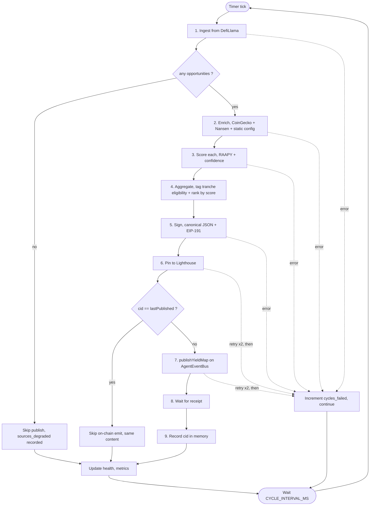
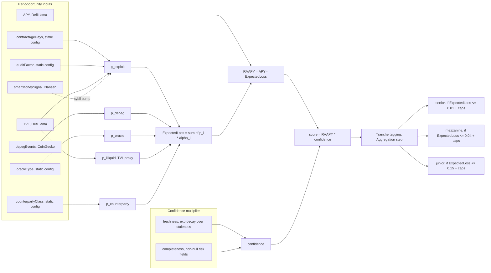
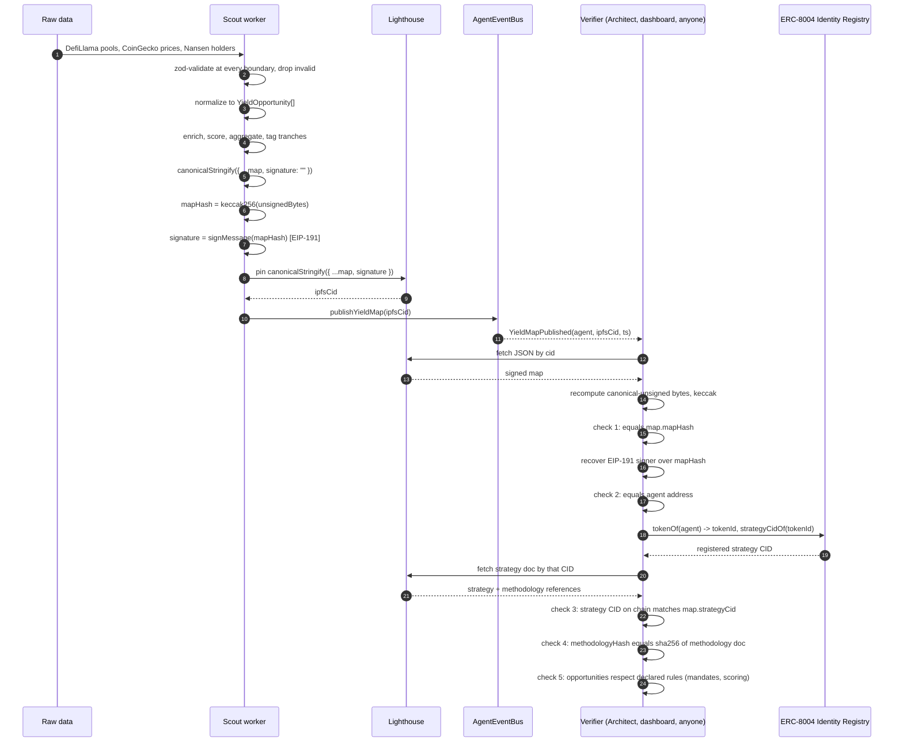

# Scout

The yield sourcing agent for Strata. Scout scans the Mantle yield universe every 60 seconds, scores each opportunity on a transparent risk-adjusted basis, and publishes a signed Yield Map on IPFS with an on-chain pointer. Scout owns no capital and makes no allocation decisions. It produces the canonical "what yield is available, and what it costs in risk" feed the other four agents consume.

For the system-level picture (all five agents, the event bus, ERC-8004 identity), see [`../README.md`](../README.md).

## Status

62 unit tests passing. Off-chain pipeline is feature complete: ingest, enrich, score, aggregate, sign, pin, on-chain emit, run loop, health, metrics. The on-chain integration test waits on the contracts engineer to deploy `AgentEventBus` and the ERC-8004 identity contract.

## Quickstart

```bash
# from repo root
pnpm install
pnpm --filter @strata/scout build
pnpm --filter @strata/scout test
```

That gets you a clean build and the test suite. To run a live cycle you need API keys and a Mantle RPC. See **Environment** below.

## The cycle, end to end

Every `CYCLE_INTERVAL_MS` (default 60s), Scout runs the same nine-stage pipeline. Errors at any stage are isolated and metered; the loop never crashes.



## What Scout does, in order

1. **Ingest.** Pull every Mantle pool from DefiLlama (`yields.llama.fi/pools`). Filter to pools whose `project` maps to a known `SourceProtocol`. Today that's `aave-v3`, `ondo-finance`, `ethena`, `mantle-staked-ether`, `mantle-mi4`, `cian-protocol`, `agni-finance`, `merchant-moe`, `fbtc`. Unknown projects are dropped.

2. **Enrich.** For each stable underlying, fetch 365 days of daily price from CoinGecko and compress deviation episodes into `DepegEvent[]`. For each asset, call Nansen for smart-money holders, fresh-wallet inflows, and a wash-trade flag. Both calls degrade gracefully: on 429, 5xx, or unexpected shape they return `null`. Never default to optimistic.

3. **Score.** Run the first-principles risk-adjusted model documented in `docs/scoring-methodology.md`. The sha256 of that doc is the `methodologyHash` stamped on every published map. Each opportunity gets:
   - five independent failure-mode probabilities (`exploit`, `depeg`, `oracle`, `illiquid`, `counterparty`)
   - an annualised `expectedLoss = sum(p_i * alpha_i)`
   - `raapy = apy - expectedLoss`
   - `confidence` from data freshness and enrichment completeness
   - `score = raapy * confidence`

4. **Aggregate.** Tag each scored opportunity with the tranches it qualifies for under nested mandates (senior, mezzanine, junior). Senior requires `expectedLoss <= 0.01`, `p_exploit <= 0.05`, `p_depeg <= 0.01`, `tvlUsd >= $50M`. Mezzanine and junior loosen each cap. Each opportunity carries `eligibleTranches`, `primaryTranche`, and per-tranche `rejectionReasons` so the transparency dashboard can explain why USDY didn't make it into senior on a given cycle.

5. **Sign.** Canonical-JSON the map with sorted keys and no whitespace. `mapHash = keccak256(canonicalBytes)`. Sign with the Scout key over the hash (EIP-191).

6. **Pin.** Upload to Lighthouse with two retries. Returns the CID.

7. **Publish.** Call `AgentEventBus.publishYieldMap(ipfsHash)` from the Scout-roled account. Wait for receipt. Record the CID in memory so the next cycle skips re-publishing if nothing changed.

8. **Loop.** `setInterval`-style wait for `CYCLE_INTERVAL_MS`, then start again. Errors in any step increment `scout_cycles_failed` and the loop keeps going.

## How an opportunity becomes a score

The scoring math is the heart of Scout. Each opportunity flows through five independent failure-mode probabilities and one confidence multiplier. The full derivation lives in [`docs/scoring-methodology.md`](docs/scoring-methodology.md); the picture below shows which inputs feed which probability.



Constants (`SCORING_CONSTANTS` in `src/pipeline/scoring.ts`) are frozen at module load. Their hash is part of `methodologyHash` on every published map, so any change to the math invalidates downstream consumers' cached interpretation of "what Scout meant by score = X."

## Data integrity and verification

Scout is only useful if the artifacts it publishes are byte-deterministic, signed, and verifiable against its declared rules. This section walks through how raw external data becomes a signed Yield Map, and how anyone can audit a published map end to end without trusting Scout.

### Normalization, the first half of integrity

Raw responses from DefiLlama, CoinGecko, and Nansen are unstructured by our standards. Before they touch any scoring logic, every external response passes through a zod schema. Anything that fails the schema is dropped and logged, never silently coerced.

The contract is:

| Stage | Schema | What's enforced |
|---|---|---|
| DefiLlama pool | `LlamaPool` (`sources/defiLlama.ts`) | required fields exist, `apy` is a number or null, `tvlUsd` is a number or null, `pool` is a string |
| CoinGecko market chart | `ChartResponse` (`enrichment/depegHistory.ts`) | `prices` is an array of `[number, number]` tuples |
| Nansen holders summary | `NansenResponse` (`enrichment/smartMoneyFlow.ts`) | three fields with bounded ranges (`smart_holder_pct`, `fresh_wallet_inflow_pct` in `[0,1]`, `wash_trade_flag` boolean) |
| Canonical opportunity | `YieldOpportunitySchema` (`types.ts`) | id non-empty, source is a known `SourceProtocol`, asset is a valid 20-byte address, apy in `[0, 10]` (sanity-cap at 1000%), tvlUsd non-negative |
| Risk factors | `RiskFactorsSchema` | every field nullable, no default fill-in |
| Scored opportunity | `ScoredOpportunitySchema` | all probabilities, severities, raapy, confidence, score, and tranche tags present and well-typed |
| Final Yield Map | `YieldMapSchema` | version literal, valid signer address, methodology hash, code commit, source lists, opportunities array, perTranche id lists, signature |

The mapping from DefiLlama's shape to ours is explicit, not implicit:

| Raw field | Canonical field | Transformation |
|---|---|---|
| `chain` | filter | drop unless `=== "Mantle"` |
| `project` | `source` | lookup in `PROJECT_TO_SOURCE` map, drop pool if not present |
| `apy` (percent) | `apy` (fraction) | divide by 100, drop if null or ≤ 0 |
| `tvlUsd` | `tvlUsd` | keep as-is, drop if null |
| `underlyingTokens[0]` | `asset` | lowercase, validate as 0x-prefixed 20-byte hex, else placeholder zero address |
| `pool` | `id` | prefix with `${source}:` |
| (now) | `lastUpdatedMs` | `Date.now()` |
| (full raw) | `raw` | preserved as-is for audit replay |

Failure rules (the same ones that protect the rest of the pipeline):

1. **Zod boundary failures drop the row.** Never substitute defaults.
2. **HTTP failures on enrichers return `null`.** The corresponding `RiskFactors` field is null, and `confidence` drops accordingly through the completeness denominator.
3. **A whole source timing out marks it degraded.** It appears in `sourcesDegraded[]` on the published map metadata so consumers can see what Scout was missing.
4. **A cycle producing zero valid opportunities does not publish.** An empty map would misrepresent Scout's view; we'd rather emit nothing.

### The signing pair

Scout has one cryptographic identity. It is used everywhere consistently:

```
SCOUT_PRIVATE_KEY ── viem.privateKeyToAccount() ──> scoutAddress
                                                      │
                                                      ├── owner of the ERC-8004 identity NFT (token N)
                                                      │
                                                      ├── holder of Role.Scout on AgentEventBus
                                                      │
                                                      └── EIP-191 signer of every Yield Map
```

The same address shows up in four places on chain (NFT owner, role-holder on the bus, `agent` field of every emitted event, recovered signer of the IPFS payload). Any reader can cross-check all four without trusting Scout's worker.

### Canonical JSON and the map hash

A Yield Map is signed over a deterministic representation of itself, not the loose JSON the runtime constructs. The canonicalisation rule lives in `publication/signer.ts` as `canonicalStringify`:

1. At every level, object keys are sorted alphabetically.
2. No whitespace anywhere (no indentation, no trailing newline).
3. Arrays preserve their order (arrays are sequences, not bags).
4. `null`, booleans, numbers, and strings serialize with standard `JSON.stringify` semantics.

Two equivalent input objects with keys in different orders produce byte-identical canonical output. That gives us idempotency: same inputs, same cycle, same canonical bytes, same hash, same CID.

The map hash is computed over the unsigned form:

```
unsignedCanonical = canonicalStringify({ ...map, signature: "" })
mapHash           = keccak256(toBytes(unsignedCanonical))
signature         = wallet.signMessage({ message: { raw: mapHash } })
finalMap          = { ...map, signature }
finalCanonical    = canonicalStringify(finalMap)
```

The `finalCanonical` bytes are what gets pinned to Lighthouse. The returned CID is the value Scout passes to `bus.publishYieldMap(ipfsHash)`.



### The five integrity checks (anyone can run them)

For any `YieldMapPublished` event on `AgentEventBus`, a verifier with nothing more than the chain, an IPFS gateway, and a copy of viem can confirm or reject the map in five steps.

| # | Check | What it proves |
|---|---|---|
| 1 | `keccak256(canonicalStringify({ ...map, signature: "" }))` equals `map.mapHash` | The canonical bytes match the hash, so the map's content is exactly what was signed. Any tampering with even one field changes the hash. |
| 2 | `recoverMessageAddress({ message: { raw: map.mapHash }, signature: map.signature })` equals the `agent` in the event | The map was signed by the wallet that emitted the event, not by a third party who happened to publish a CID. |
| 3 | `identity.strategyCidOf(identity.tokenOf(agent))` equals `map.publisher.strategyCid` | The agent's on-chain identity declares the same strategy that the map cites. No swap-in of a different rule set behind the reader's back. |
| 4 | `sha256(methodologyDocBytes)` equals `map.methodologyHash` | The scoring algorithm version the map claims to use is the version the strategy doc currently links to. Math drift is detectable. |
| 5 | Re-run scoring on `map.opportunities[].raw` with the constants from the methodology doc | Reproduce `expectedLoss`, `raapy`, `confidence`, `score`, and tranche tags. They must match what the map asserts. |

If all five pass, the map is genuine: signed by the registered Scout, produced under the strategy currently linked from its identity NFT, computed with the methodology that strategy points at, and the published numbers are recomputable from the raw inputs the map carries.

If any check fails, the artifact is rejected. The chain log retains the rejected event but downstream agents and dashboards refuse to act on it.

### Where to break things and what happens

Worth knowing what each compromise looks like:

| If someone has | They can | They cannot |
|---|---|---|
| Read access to the bus log | replay any past map, cite hashes, build their own dashboard | forge maps that pass checks 1 or 2 |
| Read access to IPFS | fetch any past or current map and strategy doc | tamper with content (CIDs are content-addressed) |
| Write access to Lighthouse with our API key | pin garbage at new CIDs | get those CIDs into a YieldMapPublished event (requires the bus role + Scout key) |
| The Scout private key | sign any map and emit through the bus | claim a different agent's identity (the identity NFT is bound to Scout's address) |
| The Identity Registry owner key | rotate Scout's strategy CID | rewrite past events or past map content (history is immutable) |

The combination an attacker needs is "Scout private key + Identity Registry owner key + a way to backdate strategy docs," and there is no such backdating because IPFS CIDs are content-hashes and the registry's `updateStrategyCid` calls are themselves on-chain events.

## External integrations (locked at four)

| Source | Purpose | Auth |
|---|---|---|
| DefiLlama | Full Mantle pool universe, APY, TVL | None |
| CoinGecko | 365d daily price for depeg analysis | Demo API key |
| Nansen | Smart-money signals | Paid API key |
| Lighthouse | IPFS pin | API key |

Plus Mantle RPC for emitting events and reading the identity NFT. Nothing else. Mantlescan, Ondo API, Ethena API, CIAN API, Pinata, web3.storage, 1inch, Odos, Allora, OraKle, Agni/Merchant Moe subgraphs are all explicitly out of scope. If we ever need more accuracy on one protocol, that comes in as an on-chain *override* fetcher, not a new API integration.

## Environment

`agents/scout/.env.example` is the source of truth. Required:

```
MANTLE_RPC_URL=https://rpc.mantle.xyz
SCOUT_PRIVATE_KEY=0x...                  # Scout's signing key (same address that gets Role.Scout on the bus)
AGENT_EVENT_BUS_ADDRESS=0x...            # deployed by the contracts engineer
LIGHTHOUSE_API_KEY=...
COINGECKO_API_KEY=...                    # Demo tier is fine
NANSEN_API_KEY=...                       # paid
CYCLE_INTERVAL_MS=60000
LOG_LEVEL=info
```

Optional fallback: `MANTLE_RPC_URL_FALLBACK` (defaults to `https://mantle.publicgoods.network`).

## Project layout

```
agents/scout/
  src/
    index.ts                          # entrypoint (boots config, clients, run loop)
    config.ts                         # zod-validated env loader
    types.ts                          # canonical schemas (YieldOpportunity, ScoredOpportunity, YieldMap, Tranche)
    chain/
      client.ts                       # viem PublicClient + WalletClient on Mantle (chain id 5000) with RPC fallback
    pipeline/
      ingestion/
        sourceFetcher.ts              # SourceFetcher interface
        sources/defiLlama.ts          # the canonical fetcher, project -> source map
        index.ts                      # runIngestion: parallel, isolated per-source, timeouts
      enrichment/
        protocolConfig.ts             # static per-protocol map: auditFactor, oracleType, counterpartyClass, contractAgeDays
        depegHistory.ts               # CoinGecko 365d -> DepegEvent[]
        smartMoneyFlow.ts             # Nansen holders summary -> SmartMoneySignal | null
      scoring.ts                      # RAAPY + confidence, frozen SCORING_CONSTANTS
      aggregation.ts                  # MANDATES + per-tranche tagging + score-sorted lists
      orchestrator.ts                 # runCycle: ingest -> enrich -> score -> aggregate -> publish
    publication/
      signer.ts                       # canonicalStringify + signYieldMap (EIP-191)
      ipfs.ts                         # Lighthouse pin with retry
      onchain.ts                      # publishOnChain wrapper around AgentEventBus.publishYieldMap
      publish.ts                      # Publisher interface, makePublisher factory
      abi/agentEventBus.ts            # minimal ABI for the one function Scout calls
    cache/
      lastPublished.ts                # in-memory dedup state (no persistence; chain log is the history)
    monitor/
      health.ts                       # HealthState: healthy iff last cycle within 2x interval
      metrics.ts                      # prom-client counters and gauges
    runLoop.ts                        # runScoutLoop: drives runCycle on a timer
  docs/
    strategy-v1.md                    # what Scout does and doesn't do (pinned to IPFS, linked from identity NFT)
    scoring-methodology.md            # the algorithm with worked examples (sha256 is methodologyHash)
  scripts/
    upload-strategy.ts                # pin both docs to Lighthouse, print CIDs and methodologyHash
  tests/
    unit/                             # vitest, msw-mocked HTTP, viem mocked
```

## How Scout fits the event bus

Scout is one of four agents that emits through the shared `AgentEventBus` contract. The role bootstrap is:

1. Generate the Scout keypair off-chain. The address is the agent's permanent on-chain identity.
2. Pin `docs/strategy-v1.md` and `docs/scoring-methodology.md` to Lighthouse via `pnpm --filter @strata/scout exec tsx scripts/upload-strategy.ts`. The script prints `{ strategyCid, methodologyCid, methodologyHash }`.
3. The owner of the ERC-8004 identity contract calls `identity.register(scoutAddress, strategyCid)`. That mints Scout's identity token.
4. The owner of `AgentEventBus` calls `bus.setRole(scoutAddress, Role.Scout)`. From that point Scout's address can call `publishYieldMap(string)` and the role check passes. Other addresses get reverted with `NotAuthorized`.
5. Scout's worker starts. Every cycle ends with `bus.publishYieldMap(ipfsHash)` from `scoutAddress`, which emits:

```
event YieldMapPublished(address indexed agent, string ipfsHash, uint256 timestamp);
```

Architect (and any dashboard) listens for this event via viem `watchContractEvent`. To verify a published map end-to-end:

- Read the event. Note `agent` and `ipfsHash`.
- Fetch the JSON from any IPFS gateway (Lighthouse, ipfs.io, dweb.link).
- Recover the EIP-191 signer over the canonical-unsigned hash. The recovered address must equal `agent`.
- Look up `agent` in the identity contract. The token's current strategy CID must match what the map declares.
- The map's `methodologyHash` must equal the sha256 of `scoring-methodology.md` linked from that strategy doc.

If all match, you have proven the map was produced by the registered Scout under its declared rules. Anyone can cite or replay it.

## How to update the strategy

Strategy docs are versioned. When the methodology or sources change, do not mint a new identity. Pin a new doc and update the CID on the existing token:

```bash
pnpm --filter @strata/scout exec tsx scripts/upload-strategy.ts
# capture the new strategyCid from output
# then have the owner call:
# identity.updateStrategyCid(scoutTokenId, newCid)
```

Old CIDs remain readable from IPFS. The chain log of `updateStrategyCid` calls is itself the version history.

## Running tests

```bash
pnpm --filter @strata/scout test              # one-shot
pnpm --filter @strata/scout test:watch        # watch mode
```

The suite covers the full off-chain pipeline. HTTP calls are msw-intercepted. Chain calls use viem mocks. There is no integration test against the real `AgentEventBus` in this package yet; that lands once the contract is deployed.

## Running a live cycle

Once you have a deployed `AgentEventBus` address, the Scout role granted, and a funded Scout key on Mantle Sepolia or mainnet, fill in `.env` and run:

```bash
pnpm --filter @strata/scout dev
```

You should see one cycle every `CYCLE_INTERVAL_MS`. The first successful cycle moves the agent to healthy. Metrics on `/metrics`, health on `/healthz` (HTTP server wiring is in `runLoop` consumers, not exposed yet in the entrypoint stub).

## Failure modes

- A source fetcher throws or times out: marked degraded in the map metadata, the cycle continues.
- An enricher returns null: the corresponding risk field stays null, confidence drops accordingly.
- Lighthouse pin fails after 2 retries: skip this cycle's on-chain emit. Next cycle retries.
- On-chain tx reverts: retry up to twice with backoff. After that, log and continue.
- Zero opportunities in a cycle: do not publish. Empty maps would lie about Scout's view.
- Same CID as last cycle: skip the on-chain emit. The chain log doesn't need duplicate events.

## Things Scout never does

- Move capital. That's Architect plus Sentinel plus the TrancheVault contract.
- Sign trades.
- Decide tranche allocations. Scout publishes eligibility tags, Architect decides.
- Write to any contract other than `AgentEventBus.publishYieldMap`. The role check would reject anything else.
- Persist a local mirror of its event history. Queries about prior cycles go to the chain log and IPFS.
