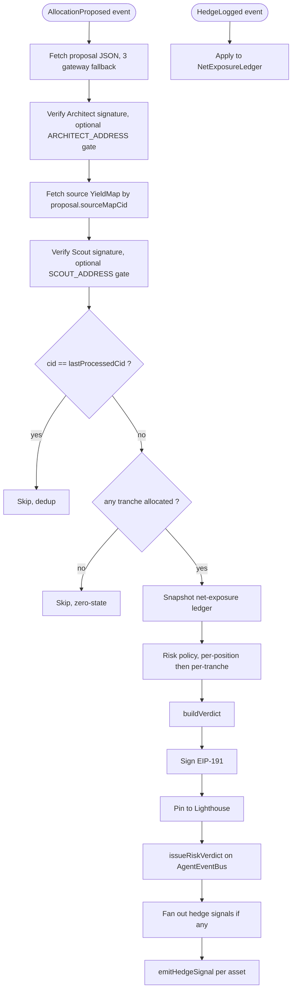

# Sentinel

The risk agent for Strata. Sentinel subscribes to Architect's `AllocationProposed` events on `AgentEventBus`, fetches and verifies the proposal and its source YieldMap, runs a deterministic risk policy that produces a per-tranche verdict (green / yellow / red), and emits `RiskVerdictIssued` with a signed reasoning document pinned to IPFS. Where the gross exposure on any asset exceeds the configured delta cap, Sentinel also emits `HedgeSignalEmitted` addressed to Operator. Sentinel never executes trades and never moves capital.

For the system-level picture (all five agents, the event bus, ERC-8004 identity), see [`../README.md`](../README.md).

## Status

~25 unit tests passing. Off-chain pipeline is feature complete: subscribe, fetch, verify, evaluate, build, sign, pin, on-chain emit (verdict + hedge signals), net-exposure ledger, event-driven run loop, health, metrics. Smoke-tested: entrypoint boots cleanly, `/healthz` and `/metrics` serve. The on-chain integration smoke waits on the coworker's `AgentEventBus` deployment with `RiskVerdictIssued` + `HedgeSignalEmitted` events and `Role.Sentinel`.

## Quickstart

```bash
# from repo root
pnpm install
pnpm --filter @strata/sentinel build
pnpm --filter @strata/sentinel test
```

To replay one cycle off-chain against a real Architect-pinned proposal CID:

```bash
pnpm --filter @strata/sentinel inspect --proposal-cid <proposalCid>
cat agents/sentinel/verdict-output.md
```

The inspect script forces `SENTINEL_DRY_RUN=true`, pins the clock at `1_700_000_000_000`, and uses an ephemeral key.

## The cycle, end to end

Event-driven, two subscriptions feed the orchestrator.



## What Sentinel does, in order

1. **Subscribe.** `AllocationProposed` triggers a verdict cycle. `HedgeLogged` updates the in-memory ledger continuously; the ledger snapshot at proposal time feeds the hedge-signal detector.

2. **Fetch.** Pull the proposal JSON by CID, then the source YieldMap by `proposal.sourceMapCid`. Three-gateway fallback (Lighthouse, ipfs.io, dweb.link), 10s timeout per gateway. Both blobs are zod-validated before any logic touches them.

3. **Verify.** Recompute `keccak256(canonicalStringify({...artifact, signature: ''}))` for each. Recover EIP-191 signer. Assert it matches the artifact's `publisher.address`. When `ARCHITECT_ADDRESS` or `SCOUT_ADDRESS` are set, the recovered signer must also equal that address. Any failure increments `sentinel_verification_failures_total` and the cycle is skipped.

4. **Evaluate.** Run the deterministic risk policy in [`docs/risk-methodology.md`](docs/risk-methodology.md). For each position in each allocated tranche:
   - Depeg breach (per-tranche bps cap on historical max deviation)
   - TVL below per-tranche floor
   - Concentration warn (skipped when the tranche has a single position; warning a 100% solo allocation is tautological)
   - Smart-money outflow worse than -$5M over 7d → red
   - The position verdict is the worst severity triggered. Tranche verdict: any red OR 2+ yellows → red; 1 yellow → yellow; else green.

5. **Detect hedge breaches.** For each asset referenced by any allocated position: `grossUsdByAsset[A] = totalDepositsBaselineUsd * trancheBps/10000 * positionBps/10000` summed across positions. `deltaUsd = grossUsd - netExposure[A]`. If `|delta| > $250k`, emit a hedge signal with `targetNotionalUsd = round(delta)` (signed: positive = needs short, negative = needs long). Signals are sorted by asset address for stable ordering.

6. **Build.** `verdictId = uint256(keccak256(sourceProposalCid + '|' + publishedAtMs))`. Per-signal: `signalId = uint256(keccak256(verdictCid + '|' + asset + '|' + publishedAtMs))`.

7. **Sign + pin + emit.** Canonical-stringify with `signature: ''`, hash, EIP-191 sign with the Sentinel key. Pin to Lighthouse. Emit `issueRiskVerdict(proposalId, seniorVerdict, mezzVerdict, juniorVerdict, reasoningHash)`. Then for each pending hedge signal, sign + pin + `emitHedgeSignal(hedgedAsset, targetNotionalUsd, reasoningHash)`.

## Risk policy constants

Frozen in `src/pipeline/riskPolicy.ts` as `RISK_CONSTANTS`. Changing any constant changes `risk-methodology.md`'s sha256, which changes `methodologyHash` on every emitted verdict.

| Constant | Senior | Mezzanine | Junior |
|---|---|---|---|
| `depegBpsThresholdByTranche` | 50 | 200 | 500 |
| `tvlFloorUsdByTranche` | $50M | $10M | $1M |
| `concentrationWarnBpsByTranche` | 4500 | 3500 | 2000 |

Global: `smartMoneyOutflow7dRedUsd = -5_000_000`, `hedgeDeltaCapUsd = 250_000`.

## Replayability

Anyone with the source at `codeCommit`, [`docs/risk-methodology.md`](docs/risk-methodology.md) whose sha256 matches `methodologyHash`, the source proposal at `sourceProposalCid`, and the hedge-ledger reconstructed from on-chain `HedgeLogged` events up to the proposal block can reproduce the verdict and the ordered hedge signals. Two fields differ in live runs: `publishedAtMs` and `signature`.

## File layout

```
agents/sentinel/
  src/
    chain/client.ts                viem PublicClient + WalletClient
    config.ts                      zod env loader
    types.ts                       RiskVerdict + HedgeSignal schemas
    ipfs/fetch.ts                  AllocationProposal + YieldMap fetchers
    verify/proposal.ts             Architect EIP-191 verifier
    verify/yieldMap.ts             Scout EIP-191 verifier
    subscription/allocationProposed.ts
    subscription/hedgeLog.ts
    pipeline/netExposure.ts        sum-of-deltas ledger
    pipeline/riskPolicy.ts         deterministic verdict + hedge-signal detection
    pipeline/buildVerdict.ts       canonical artifact composer
    pipeline/orchestrator.ts       runVerdictCycle with dedup + signal fanout
    publication/onchain.ts         issueRiskVerdict + emitHedgeSignal, AbortError on revert
    publication/publish.ts         sign + pin + emit
    publication/abi/agentEventBus.ts
    monitor/health.ts + monitor/metrics.ts
    runLoop.ts
    index.ts                       live entrypoint
  docs/
    strategy-v1.md
    risk-methodology.md            sha256 = methodologyHash
  scripts/
    inspect-verdict.ts
    upload-strategy.ts
  tests/unit/
```

## Environment

| Variable | Required | Default | Notes |
|---|---|---|---|
| `MANTLE_RPC_URL` | yes | | Primary RPC |
| `MANTLE_RPC_URL_FALLBACK` | no | `https://mantle.publicgoods.network` | viem fallback transport |
| `SENTINEL_PRIVATE_KEY` | yes | | 0x-prefixed 32-byte hex |
| `SENTINEL_DRY_RUN` | no | `false` | When true, skips on-chain emit |
| `AGENT_EVENT_BUS_ADDRESS` | live only | | Required when dryRun is false |
| `IDENTITY_REGISTRY_ADDRESS` | live only | | Reserved for a future on-chain lookup |
| `ARCHITECT_ADDRESS` | no | | When set, verifier requires recovered Architect signer to equal this |
| `SCOUT_ADDRESS` | no | | Same gate for the source YieldMap signer |
| `LIGHTHOUSE_API_KEY` | yes | | For pinning verdicts and signals |
| `SENTINEL_HEALTH_PORT` | no | `9092` | `/healthz` + `/metrics` HTTP server |
| `SENTINEL_IDENTITY_NFT` | no | `ipfs://placeholder` | Recorded on the verdict |
| `TOTAL_DEPOSITS_USD_BASELINE` | no | `10_000_000` | Deployment constant for gross-exposure calc; NOT in methodology hash |
| `LOG_LEVEL` | no | `info` | pino level |

## Failure modes

| Cause | Behavior |
|---|---|
| IPFS fetch fails after gateway fallback | Skip + log + `sentinel_verification_failures_total` |
| Proposal signature invalid | Skip + log + metric |
| Map signature invalid | Skip + log + metric |
| Proposal is zero-state (no allocated tranche) | Skip (nothing to evaluate) |
| Lighthouse pin fails | Cycle aborts before on-chain emit |
| On-chain tx reverts | `AbortError`, not retried |

## Operations

- `pnpm --filter @strata/sentinel dev` to run the live loop.
- `pnpm --filter @strata/sentinel inspect --proposal-cid <cid>` for an off-chain cycle that writes `verdict-output.md`.
- `tsx agents/sentinel/scripts/upload-strategy.ts` pins `strategy-v1.md` + `risk-methodology.md` to Lighthouse and prints `{strategyCid, methodologyCid, methodologyHash}` for the coworker to record on Sentinel's ERC-8004 identity NFT.
- `/healthz` returns `{status: 'ok', lastVerdictAt}`; `/metrics` exposes `sentinel_verdicts_total`, `sentinel_verdicts_skipped_total{reason}`, `sentinel_hedge_signals_total`, `sentinel_verification_failures_total`, `sentinel_subscription_errors_total`, `sentinel_last_verdict_ms`.
