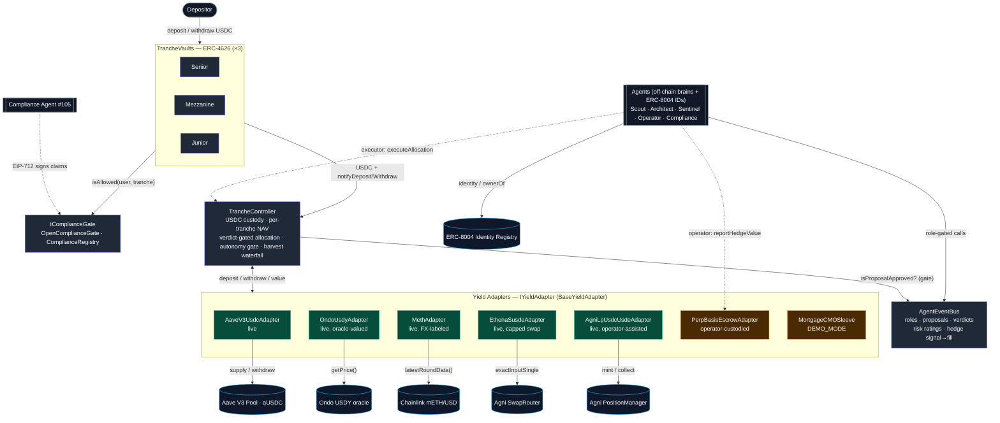
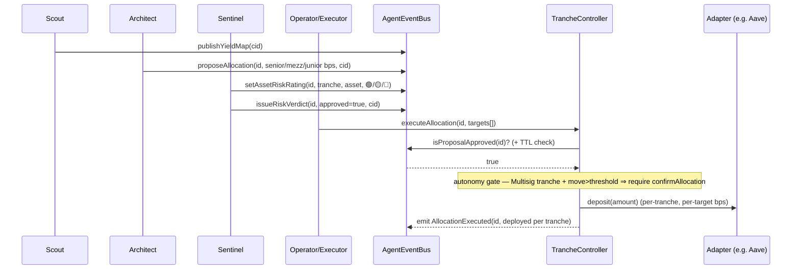

# Strata Contracts — Architecture

> On-chain risk-tranched yield protocol on **Mantle**, coordinated by autonomous agents and gated by
> on-chain compliance. This document covers the **contracts** (Aaron's lane). Agents (off-chain brains +
> ERC-8004 identities) and the frontend surfaces are separate workstreams.
>
> _Last updated: 2026-05-30 — Phase 2 complete (all real backing adapters + autonomy spectrum + deploy
> wiring built & tested). Nothing broadcast to mainnet yet._

---

## Design principles

1. **Verifiable, not narrative.** Every state change an agent drives is an on-chain event: proposals,
   risk verdicts, per-asset risk ratings, allocation executions (tied to their `proposalId`), harvests,
   and hedge signal→fill pairs. The Transparency Dashboard reads these directly — nothing is asserted
   off-chain that can't be traced on-chain.
2. **Tranched risk waterfall.** Three ERC-4626 vaults (Senior / Mezzanine / Junior) share one pool of
   capital. Yield flows **top-down, capped** per tranche; losses are absorbed **bottom-up** (Junior
   first). The `TrancheController` is the single custodian and accountant.
3. **Pluggable yield adapters.** Every yield source implements `IYieldAdapter`. The controller never
   hard-codes a protocol; adapters are registered/removed at runtime.
4. **Swappable compliance.** Each vault holds an `IComplianceGate`. Today an allow-all stub or the full
   `ComplianceRegistry` (EIP-712 claims + soulbound receipt NFT) — swappable per vault with no redeploy.
5. **Agent autonomy as a spectrum.** Per tranche, execution is either **Autonomous** (a Sentinel verdict
   is sufficient) or **Multisig** (large moves additionally need an approver's confirmation). Senior can
   opt into oversight; Junior can run fully autonomous.
6. **Honest valuation, honest labels.** Where a real on-chain integration isn't viable on Mantle, the
   piece is explicitly demo-mode or operator-assisted, and its NAV is kept conservative (peg-clamped or
   USDC-backed) — never marked-to-a-manipulable-pool, never faked. Each adapter documents its trust model.

---

## Component diagram



**Legend:** blue = Strata core · green = live real integration · amber = labelled demo/operator-custodied ·
cyan = external Mantle-mainnet contract · grey = off-chain / actor.

### Layered view (text fallback)

```
            ┌──────────────────────────────────────────────────────────┐
  ACTORS    │  Depositors    Agents (Scout/Architect/Sentinel/Operator/ │
            │                       Compliance)                          │
            └─────────┬───────────────────────┬────────────────────────┘
                      │ deposit/withdraw       │ role-gated calls
            ┌─────────▼──────────┐   ┌─────────▼────────────────────────┐
  SURFACE   │  TrancheVault ×3   │   │  AgentEventBus                    │
            │  (ERC-4626)        │   │  roles, proposals, verdicts,      │
            │   └─ IComplianceGate│  │  risk ratings, hedge signal→fill  │
            └─────────┬──────────┘   └─────────┬────────────────────────┘
                      │ USDC + notify           │ isProposalApproved (gate)
            ┌─────────▼─────────────────────────▼────────────────────────┐
  CORE      │  TrancheController                                          │
            │  USDC custody · per-tranche NAV · verdict-gated allocation  │
            │  per-tranche autonomy gate · harvest waterfall              │
            │  (gains top-down capped / losses bottom-up)                 │
            └─────────┬──────────────────────────────────────────────────┘
                      │ deposit/withdraw/value (IYieldAdapter)
            ┌─────────▼──────────────────────────────────────────────────┐
  YIELD     │ Aave  Ondo  mETH  Ethena-sUSDe  Agni-LP  Perp-escrow  CMO   │
            │ live  live  live  live(capped)   live     operator    demo  │
            └─────────┬──────────────────────────────────────────────────┘
                      │
            ┌─────────▼──────────────────────────────────────────────────┐
  MANTLE    │ Aave V3 · Ondo oracle · Chainlink · Agni router/PM · USDC   │
  MAINNET   │ ERC-8004 Identity Registry                                  │
            └─────────────────────────────────────────────────────────────┘
```

---

## Component reference

| Contract | Responsibility | Key surface |
|---|---|---|
| **`TrancheController`** | Single USDC custodian + accountant. Tracks per-tranche NAV, routes capital into adapters on an **approved** proposal (within TTL), enforces the per-tranche autonomy gate, runs the harvest waterfall, sources withdrawal liquidity from adapters. | `executeAllocation`, `harvest`, `notifyDeposit/Withdraw`, `addAdapter/removeAdapter`, `setTrancheAutonomy`, `confirmAllocation`; emits `AllocationExecuted` |
| **`TrancheVault`** ×3 | ERC-4626 share token per tranche. Custodies nothing itself — forwards USDC to the controller and reads NAV back. Holds a per-vault compliance gate. | `deposit/withdraw` (ERC-4626), `setComplianceGate` |
| **`AgentEventBus`** | Role-gated coordination + audit log between agents and the controller. Stores proposals, risk verdicts, per-asset/per-tranche ratings, and hedge signal→fill links. | `proposeAllocation`, `issueRiskVerdict`, `setAssetRiskRating`, `emitHedgeSignal`→`logHedge`, `isProposalApproved` |
| **`IComplianceGate`** | Pluggable allow/deny per (user, tranche). | `OpenComplianceGate` (allow-all) · `ComplianceRegistry` |
| **`ComplianceRegistry`** | EIP-712 verifier-signed claims → **soulbound Receipt NFT**, tranche bitmask, expiry/revocation, jurisdiction-policy records. | `claimReceipt`, `revokeReceipt`, `isAllowed`, `publishPolicy`, `setVerifier` |
| **`BaseYieldAdapter`** | Shared adapter base: owner, pause, deposit cap, `emergencyWithdraw`. | `setCap`, `setPaused`, `emergencyWithdraw` |
| **`AaveV3UsdcAdapter`** | **Live, trustless.** Supplies USDC to Aave V3; aUSDC balance is the live position value. | `deposit`, `withdraw`, `totalAssetsFor` |
| **`OndoUsdyAdapter`** | **Live, hold-only.** Custodies bridged USDY (real RWA T-bills); values it in USDC terms via Ondo's on-chain oracle. USDC in/out reverts by design (no on-chain conversion on Mantle). | `depositUsdy/withdrawUsdy` (owner), `totalAssetsFor` (oracle) |
| **`MethAdapter`** | **Live, FX-labeled, operator-funded.** Holds Mantle mETH (funded out-of-band); values it via the Chainlink Calculated mETH/USD feed with a staleness guard. USD value moves with ETH — flagged FX so the tranche layer can hedge. `deposit(usdc)` reverts. | `depositMeth/withdrawMeth` (owner), `totalAssetsFor` (Chainlink), `setMaxPriceAge` |
| **`EthenaSusdeAdapter`** | **Live, capped swap.** USDC→USDe→sUSDe via Agni; holds sUSDe. NAV uses a conservative, owner-maintained `susdeUsdeRate` (floored at 1e18) with USDe pegged to $1 — **not** a flash-manipulable pool price. Per-leg slippage guards + deposit cap. | `deposit/withdraw` (swaps), `totalAssetsFor`, `setSusdeUsdeRate`, `setMaxSlippageBps` |
| **`AgniLpUsdcUsdeAdapter`** | **Live, operator-assisted.** Provides USDC/USDe into a full-range Agni V3 NFT LP. NAV = deployed USDC cost-basis + idle USDC + idle USDe at the $1 peg (conservative; not IL/depeg-marked on the deployed leg). rAGNI rewards are off-chain → excluded from NAV until `collectFees` realizes them. | `deposit/withdraw`, `collectFees`, `totalAssetsFor`, `setMaxSlippage` |
| **`PerpBasisEscrowAdapter`** | **Operator-custodied (not trustless; `TRUSTLESS()==false`).** Escrows the USDC spot leg; the off-chain Byreal/Hyperliquid perp mark+funding is supplied by the Operator via `reportHedgeValue`, linked to a hedge `signalId`. NAV = escrowed USDC ± reported value (floored at 0). | `deposit/withdraw`, `reportHedgeValue` (owner/operator), `totalAssetsFor`, `setOperator` |
| **`MortgageCMOSleeve`** | **Demo-mode** Junior adapter: WAC coupon + CPR prepayment (yield deceleration) + `applyDefault` first-loss. Simulated coupon is capped by a seeded USDC reserve, so **NAV ≤ USDC balance always**. | `deposit/withdraw`, `seedReserve`, `applyDefault`, `setPrepaymentSpeed` |
| **`InitCapitalUsdcAdapter`** | **PARKED (WIP, not wired).** INIT Capital USDC supply; fork test intentionally red (`INC#400` — supply must route through INIT's `MoneyMarketHook`/`multicall`, not a bare transfer). Not registered in deploy. | — |

---

## Trust model per backing (read this before trusting NAV)

| Adapter | Trustless? | NAV source | Operator dependency |
|---|---|---|---|
| Aave | ✅ fully | live aUSDC balance | none |
| Ondo USDY | ⚠️ oracle + custody | Ondo on-chain oracle | operator bridges USDY in/out (no on-chain USDC↔USDY) |
| mETH | ⚠️ oracle + custody + FX | Chainlink mETH/USD (staleness-guarded) | operator funds mETH; USD value moves with ETH |
| Ethena sUSDe | ⚠️ swap + maintained rate | owner-set `susdeUsdeRate` (≥1e18), USDe@$1 | operator nudges the rate as Ethena's index accrues |
| Agni LP | ⚠️ peg-clamped | USDC cost-basis + USDe@$1 | rAGNI rewards realized off-chain; IL/depeg not marked on deployed leg |
| Perp escrow | ❌ operator-custodied | escrowed USDC ± operator-reported value | fully — off-chain Hyperliquid position; clearly labeled |
| Mortgage CMO | demo | model, capped by seeded USDC reserve | operator seeds reserve; labeled DEMO_MODE |

---

## Roles & permissions (`AgentEventBus.Role`)

| Role | Who | Can call | Produces |
|---|---|---|---|
| **Scout** | yield-discovery agent | `publishYieldMap` | `YieldMapPublished` |
| **Architect** | allocation agent | `proposeAllocation` | `Proposal` + `AllocationProposed` |
| **Sentinel** | risk agent | `issueRiskVerdict`, `setAssetRiskRating`, `emitHedgeSignal` | `Verdict`, `AssetRiskRated` (🟢🟡🔴), `HedgeSignalEmitted(signalId)` |
| **Operator** | execution agent | `logHedge(signalId, …)` | `HedgeLogged(signalId)` |
| *Executor* | controller-level role (set by owner) | `TrancheController.executeAllocation` | `AllocationExecuted` |
| *Approver* | per-tranche multisig (Multisig autonomy mode) | `confirmAllocation` | `AllocationConfirmed` |
| *Owner* | protocol admin / multisig | role + vault + adapter + target + autonomy config | — |
| *Compliance* | off-chain agent #105 | EIP-712-signs claims (off-chain) → user redeems via `ComplianceRegistry.claimReceipt` | `ComplianceVerified` (soulbound NFT) |

> The execution gate stays **binary** (`isProposalApproved`): the controller only acts on a Sentinel
> **approval** within the proposal TTL. The green/yellow/red ratings are the *richer model alongside*
> the gate — consumed by the dashboard, not a second gate. The **autonomy gate** is a separate, additional
> check: in `Multisig` mode a per-tranche deploy above `threshold` also needs `confirmAllocation`.

---

## Lifecycle — allocation cycle



**Other flows**
- **Deposit:** `User → TrancheVault.deposit → gate.isAllowed → USDC to controller → notifyDeposit (NAV credited)`.
- **Harvest:** `anyone → controller.harvest → snapshot Σ adapter.totalAssetsFor + idle → waterfall (gains top-down capped at per-tranche target·elapsed/yr; losses bottom-up Junior→Mezz→Senior) → update NAV → emit Harvested`.
- **Withdraw:** `User → TrancheVault.withdraw → controller.notifyWithdraw → _ensureLiquidity (pull from adapters by instant liquidity) → USDC to user`.
- **Hedge (agentic):** `Sentinel.emitHedgeSignal → signalId` ; `Operator.logHedge(signalId, proof)` — auditable signal→fill chain. The Operator also reports the perp leg's value into `PerpBasisEscrowAdapter.reportHedgeValue(value, signalId)`.

---

## Integrations (Mantle mainnet, chainid 5000)

All addresses below are on-chain-verified (2026-05-30). Full verdicts + the dropped-source analysis live
in `strata-docs/research/2026-05-30-tranche-backing-integrations.md`.

| Integration | Address | Status | Used by |
|---|---|---|---|
| **USDC** (6 dec) | `0x09Bc4E0D864854c6aFB6eB9A9cdF58aC190D0dF9` | live | protocol base asset |
| **Aave V3 Pool** | `0x458F293454fE0d67EC0655f3672301301DD51422` | ✅ live, fork-validated | `AaveV3UsdcAdapter` |
| **aUSDC** | `0xcb8164415274515867ec43CbD284ab5d6d2b304F` | live | position valuation |
| **Aave PoolAddressesProvider** | `0xba50Cd2A20f6DA35D788639E581bca8d0B5d4D5f` | live | reference |
| **Aave PriceOracle** (USD, 8-dec) | `0x47a063CfDa980532267970d478EC340C0F80E8df` | live | reference |
| **Ondo USDY** (18 dec, accruing) | `0x5bE26527e817998A7206475496fDE1E68957c5A6` | ✅ live, hold-only | `OndoUsdyAdapter` custody |
| **Ondo USDY Price Oracle** (`getPrice()`→1e18) | `0xA96abbe61AfEdEB0D14a20440Ae7100D9aB4882f` | ✅ live, fork-validated | `OndoUsdyAdapter` valuation |
| **mETH** (Mantle, 18 dec) | `0xcDA86A272531e8640cD7F1a92c01839911B90bb0` | ✅ live, fork-validated | `MethAdapter` custody |
| **Chainlink Calculated mETH/USD** (18 dec) | `0xB16FcAFB8378baA0a69142a325878FDCad58606A` | ✅ live, fork-validated | `MethAdapter` valuation |
| **Ethena USDe** (18 dec) | `0x5d3a1Ff2b6BAb83b63cd9AD0787074081a52ef34` | ✅ live | `EthenaSusdeAdapter` |
| **Ethena sUSDe** (18 dec; ERC-4626 reverts on Mantle) | `0x211Cc4DD073734dA055fbF44a2b4667d5E5fE5d2` | ✅ live, fork-validated | `EthenaSusdeAdapter` |
| **Agni SwapRouter** (PancakeSwap-V3 fork) | `0x319B69888b0d11cEC22caA5034e25FfFBDc88421` | ✅ live, fork-validated | Ethena + Agni-LP swaps |
| **Agni USDC/USDe pool** (fee 100, tickSpacing 1, token0=USDC) | `0xBCf99c834E65E8a58090E20eDc058279317865BD` | ✅ live, fork-validated | Agni-LP + Ethena leg-1 |
| **Agni sUSDe/USDe pool** (fee 500) | `0x07277F7c1567b5324aA50a3d2F1F003E2287fBfc` | ✅ live | Ethena leg-2 |
| **Agni NonfungiblePositionManager** | `0x218bf598D1453383e2F4AA7b14fFB9BfB102D637` | ✅ live, fork-validated | `AgniLpUsdcUsdeAdapter` |
| **ERC-8004 Identity Registry** (proxy) | `0x8004A169FB4a3325136EB29fA0ceB6D2e539a432` | live | agent identities (prathadox) |

### Agent wallets (ERC-8004 `ownerOf`, verified on-chain)
| Agent | ID | Wallet |
|---|---|---|
| Scout | #101 | `0x7CAC071f0F59dEe64509ea1C3BD8245bE529fcdE` |
| Architect | #102 | `0xbFDb8d132358b2f46D3104Ef484048Bb916De714` |
| Sentinel | #103 | `0xfE7EB19092F03E00B6eD0a248D38E80e0aA8708f` |
| Operator | #104 | `0xB342B41A68a3c6C36Efb8f224CDd252F90aD519E` |
| Compliance | #105 | `0x59767a3E91998A07D11aBE13CD460Fa3249CA628` (ComplianceRegistry verifier) |

> ⚠️ These are the agents' **identity-NFT owner EOAs**. If an agent emits to the bus from a
> smart-contract wallet instead, grant its role to that SC-wallet address (override the
> `{SCOUT,ARCHITECT,SENTINEL,OPERATOR}_ADDRESS` env vars before running `GrantRoles`). **Open question for
> the agents owner.**

### Dropped / not viable on Mantle (validated, do not rebuild)
| Source | Why dropped |
|---|---|
| **Leverage loop (mETH↔WETH)** | No ETH-LST is a usable Aave collateral on Mantle (mETH/cmETH unlisted; wrsETH frozen, LTV 0%) and no Agni LST/WETH pool exists. Only INIT has LST-collateral → deferred to v2 via INIT. |
| **INIT Capital** | USDC supply path reverts `INC#400` (needs `MoneyMarketHook`/`multicall`). Parked; Aave already covers trustless USDC. |
| **Lendle** | Aave **V2** fork with **every reserve frozen**. Removed. |
| **MI4 ("Mantle Vault")** | Permissioned Securitize security (100k min, accredited, off-chain). Drop. |
| **CIAN "Mantle Vault"** | Right shape (direct-USDC vault) but no verifiable on-chain address found. Blocked, not built. |
| **On-chain Byreal perps** | Settles on Hyperliquid (Solana/Privy custody) — no Mantle contract → operator escrow only (`PerpBasisEscrowAdapter`). |

### Tranche → backing (as wired in `Deploy.s.sol`)
| Tranche | Profile | Backing (adapters registered) |
|---|---|---|
| **Senior** | first on yield, last on loss (~5–6%) | Aave USDC + Ondo USDY (oracle) + Ethena sUSDe (capped swap) |
| **Mezzanine** | balanced (~8–12%) | Aave USDC + Agni USDC/USDe LP + small FX-labeled mETH |
| **Junior** | first loss, residual upside | Agni LP rewards + perp-basis escrow + Mortgage CMO (demo); leveraged loop deferred to v2 |

> Adapters are registered in the controller's shared registry, not hard-bound to a tranche; the
> Architect's per-tranche `targets[]` in `executeAllocation` decide which adapter each tranche's capital
> flows into. The mapping above is the intended allocation, not a contract-enforced binding.

---

## Test coverage

- **96 default tests** (`forge test`): unit (every contract) + end-to-end lifecycle + harvest-waterfall
  invariants + CMO↔controller integration (default → Junior-first-loss) + autonomy spectrum + perp escrow
  + the deploy-wiring fallback path.
- **Live-Mantle fork tests** (`MANTLE_RPC_URL=https://rpc.mantle.xyz FOUNDRY_NO_MATCH_PATH= forge test --match-path 'test/fork/*'`):
  Aave, Ondo (oracle), mETH (Chainlink ×3), Ethena (×4), Agni LP (×7), DeployWiring (×3) — **all green**.
  The only red fork tests are the **parked INIT adapter** (×2, intentional `INC#400`).
- **Run a single suite:** `… forge test --match-contract <Name> -vv`.
- ⚠️ **Build cache caveat (this machine):** forge's incremental cache can run stale bytecode — always
  `forge clean` before `forge test` when verifying.

---

## Deploy

`script/Deploy.s.sol` is chainid-branched and split into a broadcast-free `deployAll(admin)` (so the
dry-run test can exercise the exact mainnet path) and a thin `run()` wrapper that broadcasts + writes
`deployments/<chainid>.json`.

- **Mantle mainnet (5000):** wires `ComplianceRegistry` (verifier = Compliance #105) as the gate on all
  three vaults, deploys + registers + `$1000`-caps all six live adapters, sets tranche targets.
- **Any other chain:** allow-all `OpenComplianceGate` + a single `MockYieldAdapter` (smoke deploy).
- `script/GrantRoles.s.sol` grants the four bus roles, defaulting to the verified agent wallets above
  (env-overridable).
- **Proven correct** by `test/fork/DeployWiring.fork.t.sol` (registry gates all vaults, verifier correct,
  all six adapters registered + capped, roles mapped) — no gas, no key.

```bash
# capped mainnet broadcast (blocked on funded key + agent bus-address confirm — see ONBOARDING)
DEPLOYER_PRIVATE_KEY=… forge script script/Deploy.s.sol     --rpc-url mantle --broadcast
AGENT_EVENT_BUS_ADDRESS=… forge script script/GrantRoles.s.sol --rpc-url mantle --broadcast
```

---

## Known limitations (be honest in the demo)

- **Unaudited.** Single-owner god-powers exist (`emergencyWithdraw`, `applyDefault`, `setSusdeUsdeRate`,
  `reportHedgeValue`). Fine for a capped hackathon launch; not production-hardened.
- **Several adapters are operator-trusted** (see the trust-model table) — clearly labeled, never disguised
  as trustless.
- **The dry-run proves wiring, not the live broadcast.** "Provably wired" ≠ "deployed and confirmed live."
- **Jurisdiction Policies are a mapping**, not NFTs (spec-faithful; NFT framing optional).
- **Oracle layer is Chainlink only**; Allora/OraKle named in the doc are evaluate-then-decide.

---

## Deferred / next

- **Capped mainnet broadcast** — the only remaining step; needs a funded deployer key + confirmation of
  each agent's bus-sending address (EOA vs SC-wallet).
- **Leverage loop (Junior)** — deferred to v2 via INIT (not trustless on Mantle today).
- **CIAN / Mantle-Vault adapter** — blocked on a verifiable on-chain vault address.
- **Allora / OraKle oracle** — evaluate for risk/FX pricing.
- **Jurisdiction-Policy NFTs** — optional upgrade from the current mapping.

> Nothing is deployed to mainnet yet. See `strata-docs/STATUS.md` for the live handoff state.
