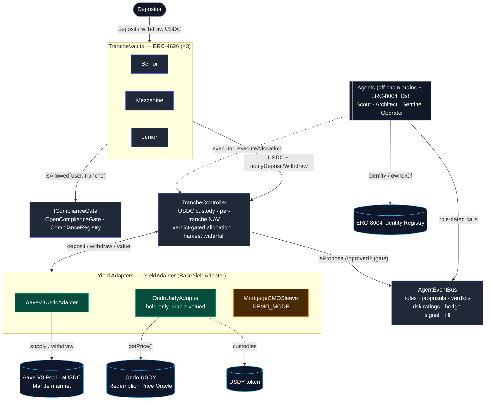
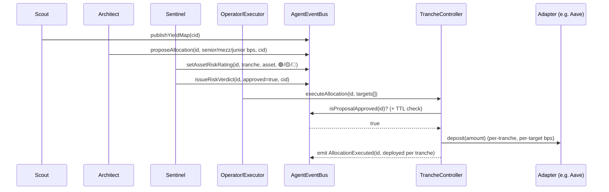

# Strata Contracts — Architecture

> On-chain risk-tranched yield protocol on **Mantle**, coordinated by autonomous agents and gated by
> on-chain compliance. This document covers the **contracts** (Aaron's lane). Agents (off-chain brains +
> ERC-8004 identities) and the frontend surfaces are separate workstreams.

---

## Design principles

1. **Verifiable, not narrative.** Every state change an agent drives is an on-chain event: proposals,
   risk verdicts, per-asset risk ratings, allocation executions (tied to their `proposalId`), harvests,
   and hedge signal→fill pairs. The Transparency Dashboard reads these directly — nothing is asserted
   off-chain that can't be traced on-chain.
2. **Tranched risk waterfall.** Three ERC-4626 vaults (Senior / Mezzanine / Junior) share one pool of
   capital. Yield flows **top-down, capped** per tranche; losses are absorbed **bottom-up** (Junior
   first). The `TrancheController` is the single custodian and accountant.
3. **Pluggable yield adapters.** Every yield source implements `IYieldAdapter`. The controller never
   hard-codes a protocol; adapters are registered/removed at runtime.
4. **Swappable compliance.** Each vault holds an `IComplianceGate`. Today an allow-all stub or the full
   `ComplianceRegistry` (EIP-712 claims + soulbound receipt NFT) — swappable per vault with no redeploy.
5. **Honest demo-mode labels.** Where a real on-chain integration isn't viable on Mantle, the piece is
   explicitly `DEMO_MODE` (e.g. the mortgage CMO sleeve) and its NAV is kept fully USDC-backed — never
   faked.

---

## Component diagram



**Legend:** blue = Strata core · green = live real integration · amber = labelled demo-mode · cyan =
external Mantle-mainnet contract · grey = off-chain / actor.

### Layered view (text fallback)

```
            ┌──────────────────────────────────────────────────────────┐
  ACTORS    │  Depositors        Agents (Scout/Architect/Sentinel/Op)   │
            └─────────┬───────────────────────┬────────────────────────┘
                      │ deposit/withdraw       │ role-gated calls
            ┌─────────▼──────────┐   ┌─────────▼────────────────────────┐
  SURFACE   │  TrancheVault ×3   │   │  AgentEventBus                    │
            │  (ERC-4626)        │   │  roles, proposals, verdicts,      │
            │   └─ IComplianceGate│  │  risk ratings, hedge signal→fill  │
            └─────────┬──────────┘   └─────────┬────────────────────────┘
                      │ USDC + notify           │ isProposalApproved (gate)
            ┌─────────▼─────────────────────────▼────────────────────────┐
  CORE      │  TrancheController                                          │
            │  USDC custody · per-tranche NAV · verdict-gated allocation  │
            │  harvest waterfall (gains top-down capped / losses bottom-up)│
            └─────────┬──────────────────────────────────────────────────┘
                      │ deposit/withdraw/value (IYieldAdapter)
            ┌─────────▼──────────────────────────────────────────────────┐
  YIELD     │  AaveV3UsdcAdapter   OndoUsdyAdapter   MortgageCMOSleeve     │
            │  (live)              (live, oracle)    (DEMO_MODE)           │
            └─────────┬───────────────────┬──────────────────────────────┘
                      │                    │
            ┌─────────▼────────┐ ┌─────────▼────────┐   ┌─────────────────┐
  MANTLE    │ Aave V3 Pool /   │ │ USDY token +     │   │ ERC-8004        │
  MAINNET   │ aUSDC            │ │ Price Oracle     │   │ Identity Reg.   │
            └──────────────────┘ └──────────────────┘   └─────────────────┘
```

---

## Component reference

| Contract | Responsibility | Key surface |
|---|---|---|
| **`TrancheController`** | Single USDC custodian + accountant. Tracks per-tranche NAV, routes capital into adapters on an **approved** proposal (within TTL), runs the harvest waterfall, sources withdrawal liquidity from adapters. | `executeAllocation`, `harvest`, `notifyDeposit/Withdraw`, `addAdapter/removeAdapter`; emits `AllocationExecuted`, `Harvested` |
| **`TrancheVault`** ×3 | ERC-4626 share token per tranche. Custodies nothing itself — forwards USDC to the controller and reads NAV back. Holds a per-vault compliance gate. | `deposit/withdraw` (ERC-4626), `setComplianceGate` |
| **`AgentEventBus`** | Role-gated coordination + audit log between agents and the controller. Stores proposals, risk verdicts, per-asset/per-tranche ratings, and hedge signal→fill links. | `proposeAllocation`, `issueRiskVerdict`, `setAssetRiskRating`, `emitHedgeSignal`→`logHedge`, `isProposalApproved` |
| **`IComplianceGate`** | Pluggable allow/deny per (user, tranche). | `OpenComplianceGate` (allow-all) · `ComplianceRegistry` |
| **`ComplianceRegistry`** | EIP-712 verifier-signed claims → **soulbound Receipt NFT**, tranche bitmask, expiry/revocation, jurisdiction-policy records. | `claimReceipt`, `revokeReceipt`, `isAllowed`, `publishPolicy` |
| **`BaseYieldAdapter`** | Shared adapter base: owner, pause, deposit cap, `emergencyWithdraw`. | `setCap`, `setPaused`, `emergencyWithdraw` |
| **`AaveV3UsdcAdapter`** | **Live.** Supplies USDC to Aave V3; aUSDC balance is the live position value. | `deposit`, `withdraw`, `totalAssetsFor` |
| **`OndoUsdyAdapter`** | **Live, hold-only.** Custodies bridged USDY (real RWA T-bills); values it in USDC terms via Ondo's on-chain oracle. USDC in/out reverts by design (no on-chain conversion on Mantle). | `depositUsdy/withdrawUsdy` (owner), `totalAssetsFor` (oracle) |
| **`MortgageCMOSleeve`** | **Demo-mode** Junior adapter: WAC coupon + CPR prepayment (yield deceleration) + `applyDefault` first-loss. Simulated coupon is capped by a seeded USDC reserve, so **NAV ≤ USDC balance always**. | `deposit/withdraw`, `seedReserve`, `applyDefault`, `setPrepaymentSpeed` |

---

## Roles & permissions (`AgentEventBus.Role`)

| Role | Who | Can call | Produces |
|---|---|---|---|
| **Scout** | yield-discovery agent | `publishYieldMap` | `YieldMapPublished` |
| **Architect** | allocation agent | `proposeAllocation` | `Proposal` + `AllocationProposed` |
| **Sentinel** | risk agent | `issueRiskVerdict`, `setAssetRiskRating`, `emitHedgeSignal` | `Verdict`, `AssetRiskRated` (🟢🟡🔴), `HedgeSignalEmitted(signalId)` |
| **Operator** | execution agent | `logHedge(signalId, …)` | `HedgeLogged(signalId)` |
| *Executor* | controller-level role (set by owner) | `TrancheController.executeAllocation` | `AllocationExecuted` |
| *Owner* | protocol admin / multisig | role + vault + adapter + target config | — |

> The execution gate stays **binary** (`isProposalApproved`): the controller only acts on a Sentinel
> **approval** within the proposal TTL. The green/yellow/red ratings are the *richer model alongside*
> the gate — consumed by the dashboard, not a second gate.

---

## Lifecycle — allocation cycle



**Other flows**
- **Deposit:** `User → TrancheVault.deposit → gate.isAllowed → USDC to controller → notifyDeposit (NAV credited)`.
- **Harvest:** `anyone → controller.harvest → snapshot Σ adapter.totalAssetsFor + idle → waterfall (gains top-down capped at per-tranche target·elapsed/yr; losses bottom-up Junior→Mezz→Senior) → update NAV → emit Harvested`.
- **Withdraw:** `User → TrancheVault.withdraw → controller.notifyWithdraw → _ensureLiquidity (pull from adapters by instant liquidity) → USDC to user`.
- **Hedge (agentic):** `Sentinel.emitHedgeSignal → signalId` ; `Operator.logHedge(signalId, proof)` — auditable signal→fill chain.

---

## Integrations (Mantle mainnet, chainid 5000)

| Integration | Address | Status | Used by |
|---|---|---|---|
| **USDC** (6 dec) | `0x09Bc4E0D864854c6aFB6eB9A9cdF58aC190D0dF9` | live | protocol base asset |
| **Aave V3 Pool** | `0x458F293454fE0d67EC0655f3672301301DD51422` | ✅ live, fork-validated | `AaveV3UsdcAdapter` |
| **aUSDC** | `0xcb8164415274515867ec43CbD284ab5d6d2b304F` | live | position valuation |
| **Aave PoolAddressesProvider** | `0xba50Cd2A20f6DA35D788639E581bca8d0B5d4D5f` | live | reference |
| **Ondo USDY** (18 dec, accruing) | `0x5bE26527e817998A7206475496fDE1E68957c5A6` | ✅ live, hold-only | `OndoUsdyAdapter` custody |
| **Ondo USDY Price Oracle** (`getPrice()`→1e18) | `0xA96abbe61AfEdEB0D14a20440Ae7100D9aB4882f` | ✅ live, fork-validated | `OndoUsdyAdapter` valuation |
| **ERC-8004 Identity Registry** | `0x8004A169FB4a3325136EB29fA0ceB6D2e539a432` | live | agent identities (prathadox) |
| **mETH** | `0xd5F7838F5C461fefF7FE49ea5ebaF7728bB0ADfa` | optional (FX-labeled Junior) | future `MethAdapter` |

### Dropped / not viable on Mantle (validated)
| Source | Why dropped |
|---|---|
| **Lendle** | Not in the backing table; on-chain it's an Aave **V2** fork with **every reserve frozen** (no deposits). Removed. |
| **Ethena sUSDe** | OFT bridge tokens only — no Mantle staking vault. Dropped from v1. |

### Tranche → backing (working model)
| Tranche | Profile | Backing |
|---|---|---|
| **Senior** | first on yield, last on loss (~5–6%) | Aave USDC + Ondo USDY (hold, oracle-valued) |
| **Mezzanine** | balanced (~8–12%) | Aave USDC (+ CIAN / Mantle-Vault / LP **once on-chain viability is validated**) |
| **Junior** | first loss, residual upside | mETH (FX-labeled) + `MortgageCMOSleeve` (demo) + leveraged loop |

---

## Test coverage

- **79 default tests** (`forge test`): unit + end-to-end lifecycle + harvest waterfall invariants +
  CMO↔controller integration (default → Junior-first-loss).
- **3 live-Mantle fork tests** (`MANTLE_RPC_URL=… FOUNDRY_NO_MATCH_PATH= forge test --match-path 'test/fork/*'`):
  Aave supply/withdraw, Ondo USDY valuation against the live oracle, Ondo hold-only guards.

---

## Deferred / next

- **Autonomy spectrum** — per-deposit *multisig vs. fully-autonomous* gating in the controller (core
  product principle; not yet built).
- **CIAN / Mantle-Vault + LP adapters** — on-chain viability not yet validated (Mezz backing).
- **Allora / OraKle oracle** integration for risk/FX pricing (mETH and any FX-priced asset).
- **Jurisdiction-Policy NFTs** (currently a mapping — spec-faithful; NFT framing optional).
- **Deploy wiring** — swap `OpenComplianceGate`→`ComplianceRegistry`, grant agent roles, capped
  mainnet deploy (needs funded deployer key + agent bus-sending addresses).

> Nothing is deployed to mainnet yet. See `strata-docs/STATUS.md` for the live handoff state.
