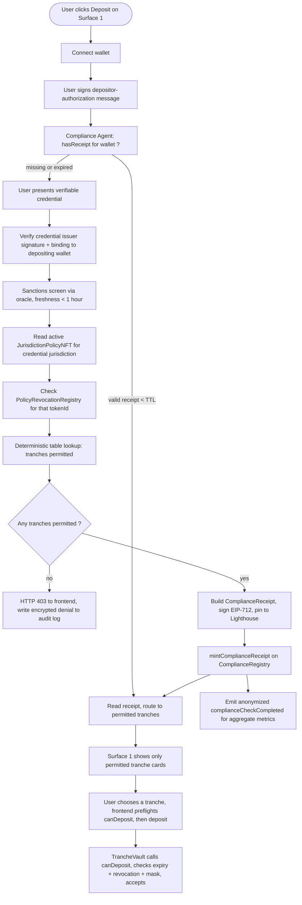

# Compliance Agent (agent 5) Plan, v2

> This is a **strategy + architecture** plan, NOT yet a TDD task-by-task implementation spec. Section 11 still has hard open questions that must be resolved with the user before a granular `2026-05-22-sentinel-operator.md`-style plan can be produced.

**Goal:** Build the fifth Strata agent: the Compliance Agent. It gates the deposit boundary, verifies a user's credential, identifies their jurisdiction, routes them to permitted tranches, mints a Compliance Receipt NFT documenting the checks performed, and publishes Jurisdiction Policy NFTs that other RWA protocols on Mantle can read.

**Status:** plan only. No code yet. Sentinel + Operator just shipped (188 tests passing, both agents smoke-tested in dry-run, builds clean). This plan was written after cross-checking those results and then attacked by two adversarial reviewers (security/regulatory + structural). v2 below incorporates the load-bearing fixes from those reviews.

---

## 0. Revision history

**v1 (initial draft) → v2 (post-pessimistic-review).** v1 fell to two structural mistakes and several privacy gaps. v2 fixes:

1. **receiptId is now input-stable**: `keccak256(wallet | credentialEvidenceHash | policyTokenId | sanctionsScreenCid)`. v1 used `walletAddress | publishedAtMs`, which broke idempotency, the inspect-script convention, and the restart-recovery story. (v1 §5.3 vs §5.7 contradiction. v2 §5.3.)

2. **Receipt schema embeds `jurisdictionPolicyCid` and `sanctionsScreenCid` directly**: v1 relied on the policy NFT being reachable to replay; v2 puts the inputs on the receipt itself, the same pattern Architect uses for `sourceMapCid`.

3. **TTL split into two clocks, on seconds, against chain time**: v1 had one 180-365 day TTL in ms against an unspecified clock, which contradicted the fresh-sanctions-screen rule. v2 has `kycExpiresAtSec` (long: 180-365 days, on chain time) and `sanctionsScreenExpiresAtSec` (short: 24 hours), both authoritative against `block.timestamp`. Vault checks both.

4. **Section 3 deposit-time mermaid no longer contains the AI step**: v1 diagram contradicted v1 prose. v2 confirms the deposit path is deterministic table lookup, full stop. AI lives only in the policy-publishing flow.

5. **Denials are NOT public per-wallet events**: v1 emitted `ComplianceDenied(wallet, reasonHash)` to chain, which created a public list of rejected applicants (a doxxing event and a regulatory liability). v2 returns 403 from the HTTP API + writes the signed denial to an access-controlled audit log; on chain only an aggregate `complianceCheckCompleted(opaqueOutcomeHash)` is emitted for sampling-rate metrics, no per-wallet trace.

6. **`canDeposit` is now actually implementable**: v1's spec referenced `permittedTranches` that lived in IPFS, which the contract couldn't read. v2 adds a `uint8 permittedTranchesMask` indexed argument on `ComplianceReceiptMinted` so the contract has the rule table it needs, with PII (jurisdictionCode) NOT on the event.

7. **AI interpretation moved off the policy NFT metadata**: v1 stored `aiInterpretation` inline, which broke content-addressing (different LLM runs of the same source produce different drafts) AND created a permanent record of any prompt-injection payload that landed. v2 stores only `aiInterpretationHash` on the policy NFT, with the draft on a separate Lighthouse CID viewable for accountability but not part of the canonical rule table hash.

8. **Policy revocation moved to a separate registry contract**: v1 had a contradiction between "policy NFTs are immutable" and "policy revocation can flip them." v2 introduces `PolicyRevocationRegistry` as a separate contract; the NFT metadata stays immutable, the registry tracks revoked tokenIds. `canDeposit` checks both.

9. **Explicit "legal entity ownership, subpoena response, GDPR" section**: v1 omitted this entire surface. v2 has §13. This is non-negotiable before a real KYC system ships, even for a hackathon.

10. **Key custody hardened**: v1 said "process env in v1, KMS in v2." v2 commits to a KMS (Turnkey or AWS KMS) for both the receipt-signer key and the policy multisig members' keys, even for the hackathon demo, because the receipt-signer's signature is the protocol's full legal claim. Documented as a hard rule in §6.10.

11. **Wallet-binding via user-signed authorization**: v1's credential-binding was agent-trust-only. v2 requires the user to sign an authorization message with their depositing wallet's key. Even a compromised agent cannot mint a receipt the user did not authorize.

12. **Junior tier still requires a minimal OFAC-only sanctions screen**: v1 said "junior is permissionless, no Sybil defense." v2 confirms permissionless wallet, but still runs the sanctions screen, because the FinCEN 2024 DeFi guidance specifically calls out the "we knowingly serve unscreened wallets" stance as creating AML liability for the protocol.

13. **Demo posture is honest about what's stubbed**: v1 recommended Option B (stub) without facing the contradiction with product.md's "Grand Champion candidate" framing. v2 keeps Option B as the recommendation but specifies that stub credentials emit with `credentialProvider: 'stub'`, the demo deploys a separate `ComplianceRegistry` instance, and the product claim is dialed back from "real KYC system" to "production-quality framework demonstrated against a stub adapter, with a documented real-adapter v2 plan."

14. **`ComplianceDenied` event removed, replaced with private audit log + opaque aggregate event**: see fix 5.

15. **Several specific contract-API gaps closed**: `permittedTranchesMask` on the mint event (fix 6), `policyTokenId` indexed on the aggregate check-completed event for traffic analysis, `revokeReceipt` restricted to Policy role only (closes the agent-key DoS surface in v1 §10), `revokeReceiptsByPolicy(policyTokenId, reasonHash)` added for mass revocation under regulatory shift, `effectiveUntilSec` added to the policy NFT for time-bounded policies.

The full v1 critique list is preserved in `docs/superpowers/notes/2026-05-23-compliance-review-findings.md` (will be created when this plan moves to implementation). Findings not addressed above are either deferred to v2 of the agent itself (e.g., zk-receipt to remove wallet from chain, model-version pinning across LLM deprecations) or treated as honest known limitations of the v1 demo scope.

---

## 1. Product context

From `product.md` Agent 5: Compliance is the legal layer. At deposit time it verifies a user's credential (via zkPass, Privado ID, or a similar verifiable-credential provider), checks sanctions lists through an oracle, identifies the user's jurisdiction, routes the user to the tranches permitted under that jurisdiction's rules, and produces two on-chain artifacts: a Compliance Receipt NFT per deposit-cycle and Jurisdiction Policy NFTs that other RWA protocols on Mantle can read.

**Architecturally critical fact:** Compliance runs **in parallel** to the rebalance loop, not inside it. Scout → Architect → Sentinel → Operator is one closed loop. Compliance is a perpendicular gate at the user-deposit boundary. It does not feed proposals, verdicts, or hedges. Section 7 has the cross-check matrix.

---

## 2. Hard constraints

These are non-negotiable for Strata work. Compliance has to live inside them.

### 2.1 The 4-integration lock

Strata is locked to four external integrations: **DefiLlama, CoinGecko, Nansen, Lighthouse.** Credential providers (zkPass, Privado ID) and sanctions oracles (Chainalysis on-chain, TRM, Elliptic) are not on this list. Resolution paths in §11.1; the v2 recommendation is **Option B (stub) for the hackathon demo, Option A (explicit exception list) for v2 of the agent**. The stub path is honest about being a stub and ships with safeguards documented below.

### 2.2 Coworker owns Solidity

`ComplianceRegistry.sol`, `ComplianceReceiptNFT.sol`, `JurisdictionPolicyNFT.sol`, `PolicyRevocationRegistry.sol` are all coworker-owned. The off-chain Compliance Agent calls into them via wrapped viem ABIs. **Claude does not write contracts/*.sol.**

### 2.3 Chain log is the source of truth

No offline mirror databases. Compliance Receipt NFTs, Jurisdiction Policy NFTs, and the policy-revocation registry ARE the historical record for on-chain state. The encrypted audit log (denial reasons, evidence blobs, AI drafts) lives on Lighthouse under access controls. The off-chain agent worker is stateless across restarts and reconstructs from chain on boot.

### 2.4 No em-dashes, no Claude trailer, hooks must run

Standing rules carry forward.

### 2.5 PII off chain, by default and on principle

Personally identifiable information never goes on chain. What goes on chain is the *outcome* of a check (`permittedTranchesMask` as a uint8 bitmap, `kycExpiresAtSec`, `policyTokenId` referencing the rules applied) plus the receipt's IPFS CID. Names, addresses, document images, jurisdiction codes, KYC tier strings, dates of birth, sanctions screen details, none of these are on chain. The wallet address is still on the receipt (it has to be, the receipt is per-wallet), but no other identifying data joins it on the event topic set.

**Honest limit:** wallet address is becoming PII-equivalent in 2026 because chain analytics routinely link wallets to real-world identities. The v1 agent accepts this trade-off because moving to stealth addresses or zk-receipts is a v2 redesign. The trade-off is named in §13.

---

## 3. End-to-end workflow



The receipt lookup short-circuit at the top makes repeat deposits cheap. The denial path is NOT a public chain event; it writes an encrypted denial reason to Lighthouse keyed by an opaque hash, returns 403 to the frontend, and the per-wallet outcome is invisible on chain.

No AI in this flow. AI lives only in §9.

---

## 4. Two distinct flows

### 4.1 Per-user deposit gate (read-heavy, frequent)

Triggered by a wallet hitting the deposit page. Fast path. The agent runs verification + screening + policy lookup, then either mints a `ComplianceReceipt` or returns 403 with an encrypted denial reason. Frontend reads the receipt to render permitted tranche cards.

### 4.2 Jurisdiction policy publishing (write-heavy, rare-to-occasional)

Triggered by a policy author (the protocol team + a credentialed compliance advisor in v1) declaring or amending a jurisdiction's rules. Outputs a `JurisdictionPolicyNFT` token whose tokenURI is the signed policy document pinned to Lighthouse. The AI policy interpreter runs here (and only here) to translate source text into a draft structured rule table; a deterministic schema validator + a human reviewer + a 2-of-N multisig with a 24-hour timelock approve before the policy NFT mints.

**Operational separation:** the publishing flow does NOT run in the same process as the deposit gate. Two binaries, two key custody domains, two HTTP APIs. The deposit-gate agent never imports the AI client.

---

## 5. How it should work (correct patterns)

### 5.1 Compliance is a gate, not an executor

The agent never moves capital. It produces signed receipts and signed denial records and signed policy artifacts. The TrancheVault contract enforces the gate by reading `ComplianceRegistry.canDeposit(wallet, trancheId)` before accepting deposits. **The agent's authority is to mint receipts; the contract's authority is to gate vault access.**

### 5.2 Determinism wherever possible, AI only in the offline supervised step

The deposit-time path is entirely deterministic:

- Credential cryptography: deterministic signature verification.
- Sanctions screening: deterministic given an oracle response.
- Jurisdiction code extraction from credential: deterministic.
- Tranche routing given (jurisdiction code, kycTier, sanctionsClear): deterministic table lookup against the active Jurisdiction Policy NFT.

AI lives **only** in the policy-publishing flow, where it helps translate fresh jurisdiction prose into a structured rule table draft. §9 has the guardrails. AI never participates in a deny/allow decision at deposit time.

### 5.3 Every check is signed and hashed

Same canonical pattern as Sentinel/Architect. Compliance Receipt JSON:

```
{
  version: '1.0',
  receiptId: uint256,                          // keccak256(wallet | credentialEvidenceHash | policyTokenId | sanctionsScreenCid)
  wallet: 0x...,
  policyTokenId: uint256,                      // which policy NFT was applied
  policyCid: string,                           // IPFS CID of that policy NFT's metadata
  policyHash: bytes32,                         // sha256 of the rule table that was applied
  policyResolvedAtBlock: uint256,              // block at which the agent read activePolicyFor()
  kycTier: 'none' | 'basic' | 'enhanced',
  jurisdictionCodeHash: bytes32,               // keccak256(jurisdictionCode | userSalt); raw code NOT on chain
  sanctionsScreenCid: string,                  // CID of the encrypted screen result blob
  sanctionsScreenAtSec: uint64,                // chain-time seconds when the screen ran
  sanctionsClear: boolean,                     // outcome bit only; details in the encrypted blob
  permittedTranchesMask: uint8,                // bit 0 = senior, bit 1 = mezzanine, bit 2 = junior
  credentialProvider: 'zkpass' | 'privado' | 'stub',
  credentialEvidenceHash: bytes32,             // hash of the credential proof
  evidenceBlobCid: string,                     // CID of the encrypted evidence blob
  depositorAuthSignature: string,              // user-signed authorization, EIP-712
  kycExpiresAtSec: uint64,                     // chain-time seconds when KYC tier becomes stale
  sanctionsScreenExpiresAtSec: uint64,         // chain-time seconds when the sanctions cap stales
  publisher: { address, identityNFT },
  methodologyHash: bytes32,                    // sha256 of compliance-methodology.md (the procedural doc; rule table is in the policy NFT)
  codeCommit: string,
  publishedAtSec: uint64,                      // chain-time seconds
  signature: string                             // EIP-712 by Compliance agent's receipt key (NOT EIP-191; see §5.6)
}
```

Notes:
- **No raw jurisdiction code on chain.** Only `jurisdictionCodeHash`, with a per-user salt also encrypted in the evidence blob. The deterministic table lookup runs off chain; the on-chain `permittedTranchesMask` is the *outcome* the contract uses to gate deposits.
- **Dual TTL.** Vault's `canDeposit` checks both `kycExpiresAtSec` and `sanctionsScreenExpiresAtSec` against `block.timestamp`. Either expired means deny.
- **`depositorAuthSignature`.** User signs an EIP-712 typed message `{ wallet, credentialEvidenceHash, deadline }` before the agent issues a receipt. This binds the receipt to user consent even if the agent key is compromised.
- **No AI fields.** No `aiInterpretation`, no LLM output. The agent's authority chain is: user authorizes → agent verifies + screens + looks up policy → table lookup → receipt.

### 5.4 Two TTLs

- **kycExpiresAtSec**: long (recommendation: 180 days for `basic`, 365 days for `enhanced`). Forces re-verification on a slow regulatory drift cadence.
- **sanctionsScreenExpiresAtSec**: short (recommendation: 24 hours, hard cap). After expiry the user can deposit IFF the agent runs a fresh sanctions screen and amends the receipt (or mints a new one). The vault enforces both. This closes v1's "fresh-screen rule contradicts 180-day TTL" hole.

Re-verification cost is non-trivial. The protocol's UX absorbs this; users with active receipts approaching `sanctionsScreenExpiresAtSec` get a frontend prompt to re-screen before depositing.

### 5.5 Policy NFTs are content-addressed, versioned, and time-bounded

```
{
  version: '1.0',
  policyTokenId: uint256,
  jurisdictionCode: 'US' | 'EU' | 'GB' | 'permissionless' | ...,
  effectiveFromSec: uint64,
  effectiveUntilSec: uint64 | null,            // null = open ended until revoked or superseded
  permittedTranchesByKycTier: {                // the actual rule table; this is what gets hashed
    'none':     uint8 mask,                    // bitmask, same encoding as receipt
    'basic':    uint8 mask,
    'enhanced': uint8 mask
  },
  sourceTextHash: bytes32,                     // sha256 of the source policy prose
  sourceTextCid: string | null,                // CID of the source text iff distributable (null for paywalled regulatory text)
  aiInterpretationCid: string | null,          // CID of the AI draft for accountability; NOT in policyHash
  aiInterpretationHash: bytes32 | null,        // sha256 of the AI draft (lets policy NFT commit to which draft was reviewed without including its content in the rule-table hash)
  aiModel: string | null,                      // e.g. 'gemini-2.5-flash'
  aiPromptHash: bytes32 | null,                // sha256 of the pessimistic-reviewer prompt template
  policyHash: bytes32,                         // sha256 of (jurisdictionCode | permittedTranchesByKycTier | effectiveFromSec | effectiveUntilSec)
  publisher: { multisigAddress, identityNFT },
  publishedAtSec: uint64,
  signatures: string[]                         // ERC-1271-compatible multisig signatures; minimum 2-of-N
}
```

To amend a policy:
1. Author writes new source text.
2. AI interpreter runs (see §9).
3. Schema validator confirms the rule table is well-formed.
4. Diff against the previous policy is produced and emailed to all multisig members.
5. Timelock starts (24 hours minimum).
6. After the timelock, 2-of-N sign and `mintPolicy(...)` is called.
7. The new token supersedes the previous token for that `jurisdictionCode`; `activePolicyFor()` returns the most-recently-effective non-revoked token.

The previous token is NOT mutated. Old receipts referencing the old token continue to resolve until their `kycExpiresAtSec`.

To revoke a policy entirely (regulatory shift):
1. Multisig calls `PolicyRevocationRegistry.revokePolicy(policyTokenId, reasonHash, reasonCid)`.
2. `canDeposit` checks revocation status and refuses receipts that reference a revoked policy.
3. Affected users see a frontend prompt to re-verify under the current active policy.

### 5.6 EIP-712, not EIP-191, for receipts

The other agents (Scout, Architect, Sentinel) use EIP-191 because their signed artifacts are agent-to-agent JSON blobs that wallets never interact with. Compliance is different: the user signs a `DepositorAuth` message in their wallet UI before the receipt mints. That signing flow demands EIP-712 typed-data so the user's wallet renders the actual fields ("Authorize Strata Compliance to issue a receipt for wallet 0x... using credential hash 0x... with deadline T"). Receipt artifact signatures from the agent also use EIP-712 for consistency.

### 5.7 Idempotency, properly

Same `(wallet, credentialEvidenceHash, policyTokenId, sanctionsScreenCid)` → same `receiptId`. If the agent crashes mid-mint, restart re-derives the same `receiptId` and the registry rejects duplicate mints. If a user re-verifies with the same credential under the same policy, the agent observes the same receiptId already minted and returns the cached on-chain receipt. Real re-verification (new credential, new screen, new policy) produces a genuinely new receiptId.

Replay: any auditor with `codeCommit`, `compliance-methodology.md` matching `methodologyHash`, the policy NFT at `policyCid`, the encrypted evidence blob at `evidenceBlobCid` (and the agent's decryption key, accessible to a multisig per §13), the encrypted sanctions screen at `sanctionsScreenCid`, and the user's `depositorAuthSignature`, can re-run the lookup and verify the same `permittedTranchesMask`.

### 5.8 Fail closed

Every error path defaults to deny. Sanctions oracle unreachable: deny. Credential signature invalid: deny. Policy NFT load fails: deny. Policy is revoked: deny. Lighthouse pin fails: deny (no receipt minted means deposit reverts at the vault). No partial trust.

---

## 6. How it should NOT work (anti-patterns)

Each of these is a real failure mode for KYC systems. Listing them by name makes them grep-able in future reviews.

### 6.1 Do NOT store raw PII on chain

No names, no government IDs, no dates of birth, no document hashes (low-entropy fields are brute-forceable), no jurisdiction codes in plaintext, no KYC tier strings. Outcomes (bitmasks, expiry timestamps, opaque hashes) on chain; details encrypted in Lighthouse.

### 6.2 Do NOT use an LLM in the deposit-time deny/allow path

LLMs are non-deterministic, slow, rate-limited, and a prompt-injection surface. The deposit-time decision must be a deterministic table lookup. AI's role is offline policy translation only.

### 6.3 Do NOT trust user-supplied credentials without verifying the issuer chain

The credential must carry an issuer signature against a key anchored in a registered trust anchor list the agent reads from chain. Verify issuer first, then extract claims. Self-attested credentials are worthless.

### 6.4 Do NOT cache sanctions screens beyond `sanctionsScreenExpiresAtSec`

Sanctions data is regulator-controlled and updates daily. Receipts pin a screen result with a 24-hour expiry; the vault enforces it. No "I checked them last week" semantics.

### 6.5 Do NOT make policy NFTs mutable

Policy versions are immutable. Amendments mint a new token. Revocations are tracked in a separate `PolicyRevocationRegistry` so the NFT metadata itself stays content-addressed. Old receipts that reference a revoked policy fail `canDeposit`.

### 6.6 Do NOT silently broaden the policy

If policy v2 expands what a tier is allowed, existing users with v1 receipts continue under v1 until re-verification. Do NOT auto-extend old receipts. The receipt is a snapshot of an applied policy.

### 6.7 Do NOT silently tighten the policy

Symmetrically. Policy v2 tightening the rules does NOT retroactively invalidate v1 receipts mid-cycle. Users finish out their `kycExpiresAtSec` window, then re-verify under v2 OR the protocol issues a `revokePolicy(v1)` if the regulatory shift demands immediate halt. Revocation forces fresh verification but is loud and auditable.

### 6.8 Do NOT let the agent self-publish policies

Two separate roles: `Role.Compliance` (receipt minter, hot key in KMS) and `Role.CompliancePolicyPublisher` (multisig 2-of-N with 24-hour timelock). The off-chain receipt-minting binary does not have access to the policy-multisig keys at all. Different binary, different KMS isolation domain.

### 6.9 Do NOT block deposits on AI availability

The AI policy interpreter is offline and supervised. If it's rate-limited or down, in-flight deposits are unaffected because they read already-published policy NFTs through a deterministic lookup.

### 6.10 Do NOT keep audit trail of denials on public chain

Denials are sensitive (a denied wallet is potentially sanctioned, wrong-jurisdiction, or otherwise legally-fraught material). The audit trail lives in an encrypted Lighthouse blob, accessible only by the protocol's legal-response multisig. On chain, only an aggregate `complianceCheckCompleted(opaqueOutcomeHash)` is emitted; the hash is not reversible to wallet without the off-chain key. This preserves auditability for legitimate regulators (who can subpoena the multisig under §13) while denying free public access to a list of rejected wallets.

### 6.11 Do NOT use the same key for receipts and policies, and do NOT keep either in process env

KMS for both. Receipt-signer key in a KMS slot accessible only to the receipt-minting binary's runtime role. Policy-multisig signer keys in members' personal hardware wallets (Ledger, Turnkey individual accounts, etc.). Receipt-key compromise must not enable policy mint; policy-key compromise must not enable receipt mint.

### 6.12 Do NOT couple compliance to the rebalance loop

Compliance is perpendicular. Scout/Architect/Sentinel/Operator do not subscribe to compliance events and do not require compliance data to function. The vault's deposit acceptance is the single integration surface.

---

## 7. Cross-checks with the other agents

| Agent | Direct interaction | Notes |
|---|---|---|
| Scout | none | Scout observes yields; depositor identity is irrelevant. |
| Architect | indirect | Architect proposes allocations regardless of who deposited. Vault per-tranche balances naturally reflect whichever compliant deposits arrived. |
| Sentinel | indirect, optional metric | A `sentinel_compliance_denial_rate` could trigger an investigation cycle if denial rate spikes. Out of scope for v1. |
| Operator | none | Hedge sizing is denominated in USD notional; depositor identity has zero bearing. |
| Vault contract | direct | TrancheVault calls `ComplianceRegistry.canDeposit(wallet, trancheId)` and reverts if false. Vault emits `DepositWithReceipt(wallet, trancheId, amount, receiptId)` so an auditor can join a capital movement to its compliance event. |

Each of Scout/Architect/Sentinel/Operator may optionally include a boot-time health check that `ComplianceRegistry` is callable. This is a system wiring sanity check, not a per-cycle dependency.

---

## 8. Pessimistic risk review

This section assumes a competent, patient adversary. Each item is a failure mode the implementation must explicitly resist. v2 expanded from v1's 11 items.

### 8.1 Credential replay across wallets

Attack: user A holds a valid zkPass credential. User B uses A's proof from a different wallet.

Defense: the credential proof must cryptographically bind to the depositing wallet. v2 also requires `depositorAuthSignature` from the depositing wallet itself; a stolen credential proof is useless without the matching wallet private key.

### 8.2 Sybil farming receipts

Attack: a sanctioned actor creates 100 wallets, gets 100 credentials, mints 100 receipts.

Defense (v1): senior and mezzanine require Sybil-resistant credentials (zkPass uniqueness proofs from Worldcoin orb scans, government-ID-anchored attestations); these credential types are enumerated in the policy NFT's `acceptedCredentialClasses` field. Junior tier accepts any verified credential but still runs the sanctions screen, which catches known-bad wallets. Junior's exposure is bounded by the tranche's first-loss design.

### 8.3 Policy NFT supply-chain attack

Attack: attacker compromises one multisig key and pressures another to co-sign a permissive policy.

Defense: 24-hour timelock on policy mints with a public diff visible to all multisig members and a community-observer feed. Any single multisig member can veto during the timelock. Multisig composition includes at least one independent credentialed compliance advisor from day one (§11.4).

### 8.4 Sanctions oracle staleness or compromise

Attack: oracle goes down or is fed bad data; sanctioned addresses pass screening.

Defense: 1-hour freshness threshold (not 24 hours as v1 said). Single oracle in v1 with explicit risk disclosure in the strategy doc; two oracles required for v2 of the agent. Fail closed when oracle is stale OR unreachable.

### 8.5 LLM prompt injection in the policy interpreter

Attack: a policy author smuggles "ignore previous instructions" into source text.

Defense: never store AI raw output in NFT metadata (v2 stores only `aiInterpretationHash` + a separate CID for the draft, the draft is read only by humans during review). Pessimistic-reviewer prompt stance (§9). Schema validator strips anything not matching the structured rule table format. A second-LLM checker (e.g., Claude reading Gemini's output) catches the most obvious injection patterns. Human reviewer is the final guard; their qualifications are spec'd in §11.4.

### 8.6 Receipt expiry race / reorg

Attack: user gets a receipt at TTL-1 second; deposit settles at TTL+1 second.

Defense: frontend pre-flights `canDeposit` and refuses to submit the deposit tx if remaining TTL is below 5 minutes. Mantle reorgs are bounded; for receipts near expiry the frontend forces a re-screen rather than racing.

### 8.7 Encrypted evidence blob loss

Attack: Lighthouse compromise loses the evidence blob; future audit impossible.

Defense: pinning to multiple IPFS providers is OFF the table because of the 4-integration lock. Instead, the agent maintains a write-ahead log of every receipt's evidence-blob bytes locally before pinning, and replicates that log to a multisig-controlled backup location. The agent's health metrics surface "blobs awaiting confirmed pin" so operators can intervene. v2 of the agent may add a second pinning provider as an explicit exception (§11.1).

### 8.8 Jurisdiction laundering

Attack: user with dual residence attests to the more permissive jurisdiction.

Defense: this is partially technical, partially policy. v1 stance: senior tier requires a **residence-bound** credential (utility bill hash, tax residency proof) NOT a citizenship credential alone. Mezzanine accepts citizenship-based credentials with stricter sanctions screen. Junior accepts any verified credential. The policy NFT enumerates acceptable credential classes per tier.

### 8.9 Forward-looking regulatory shift

Attack: a regulator publishes a binding rule that retroactively invalidates a class of receipts.

Defense: `revokeReceiptsByPolicy(policyTokenId, reasonHash, reasonCid)` is a multisig-only call that revokes all receipts derived from a given policy in one transaction. The contract stores the revocation timestamp; `canDeposit` checks it. Affected users see a frontend prompt to re-verify under the active policy. The original policy NFT is NOT mutated; only the revocation registry is updated.

### 8.10 Off-chain agent worker compromise

Attack: attacker pwns the worker process and tries to mint fraudulent receipts.

Defense: receipt-signer key lives in KMS, accessed by the worker's IAM role only at runtime. Compromise of the worker process is rate-limited by KMS request throttles. The `depositorAuthSignature` requirement (§5.3, §8.1) prevents the worker from minting receipts the user did not authorize. Audit log records every KMS request with the worker's request id, enabling post-mortem reconstruction.

### 8.11 Self-reporting bias in the AI policy interpreter

Attack: LLM training bias toward permissive readings.

Defense: pessimistic-reviewer system prompt (§9.2), second-LLM checker, structural validator, mandatory human review, 24-hour timelock. The combined defense-in-depth is deliberately redundant because each layer is individually weak.

### 8.12 GDPR / right-to-erasure collision

Attack: a depositor (or a regulator on their behalf) demands deletion of their KYC data; receipt is immutable.

Defense: at credential-presentation time the user signs an EIP-712 message that includes "I consent to retention of this audit record for the regulatory retention period of [X years], per [explicit legal basis]." This is the legitimate-interest carve-out under GDPR Article 6(1)(f) plus the legal-obligation carve-out under Article 6(1)(c) where applicable. The encrypted evidence blob CAN be destroyed under right-to-erasure; what remains is the on-chain receipt event (which holds no PII directly), the policy NFT (no user data), and an attestation hash. §13 has the full retention policy.

### 8.13 Regulatory subpoena

Attack: a regulator subpoenas the protocol for all KYC records relating to a specific wallet.

Defense: §13 documents legal entity ownership (the Compliance NFT identity is registered to a Cayman foundation or analogous; subpoenas land at the foundation's registered agent). The foundation's compliance officer can decrypt evidence blobs via a multisig-controlled key (3 of 5 members). The off-chain agent worker holds only an ephemeral runtime decryption key, derived from KMS on each access, not retained at rest.

### 8.14 Policy publisher key collusion

Attack: the entire multisig is compromised or colludes.

Defense: a community-observable timelock + open diff during the 24 hours, plus a `policyEmergencyPause()` callable by any of the four other agent identities (Scout, Architect, Sentinel, Operator) acting in concert. This is a hard-cap circuit breaker; abusing it has consequences (each agent's ERC-8004 identity records the pause invocation, and the protocol team can revoke an agent identity that abuses the brake).

### 8.15 Stub-credential injection in production

Attack: someone deploys the demo `ComplianceRegistry` instance to production by mistake, allowing `credentialProvider: 'stub'` receipts to gate real deposits.

Defense: production `ComplianceRegistry` deploys with a hard-coded `acceptedProviders` allowlist that excludes `stub`. The deploy script verifies the allowlist matches the expected production set; any mismatch aborts deploy. Demo and production registries have different addresses; the vault hard-references the production address.

### 8.16 Aggregate-event traffic analysis

Attack: the `complianceCheckCompleted(opaqueOutcomeHash)` event reveals timing patterns. A wallet's deposit activity can be correlated with that event by block number, deanonymizing it indirectly.

Defense: emit the aggregate event in batches every N receipt-mints, with deliberate jitter, instead of one-per-mint. This is a known leak; v2 of the agent moves to a zk-rollup-style aggregate to remove it entirely.

---

## 9. The AI / LLM layer

AI has exactly one role: helping translate fresh jurisdiction policy prose into a structured rule table during the rare, supervised publishing flow. Zero role at deposit time.

### 9.1 Flow placement

```
                publishing flow (rare, supervised)
policy author --> source text --> AI interpreter 1 (Gemini, pessimistic stance)
                                   |
                                   v
                      AI interpreter 2 (Claude, cross-check)
                                   |
                                   v
                      deterministic schema validator
                                   |
                                   v
                      structural diff vs. previous policy
                                   |
                                   v
                      24-hour public timelock (diff posted to all multisig + observers)
                                   |
                                   v
                      2-of-N multisig signs (must include the credentialed compliance advisor)
                                   |
                                   v
                      mintPolicy on JurisdictionPolicyNFT
```

```
                deposit-time flow (frequent, NO AI)
user wallet --> credential verify --> sanctions screen --> jurisdiction code
                                                              |
                                                              v
                                               read JurisdictionPolicyNFT
                                                              |
                                                              v
                                       PolicyRevocationRegistry check
                                                              |
                                                              v
                                       deterministic table lookup
                                                              |
                                                              v
                                       sign + pin + mint ComplianceReceipt
```

### 9.2 The pessimistic-reviewer prompt

The interpreter LLM is instructed to be a hostile critic. The prompt is signed and pinned to Lighthouse like any methodology artifact; its `aiPromptHash` is recorded on every policy NFT that used it.

> You are an adversarial securities lawyer reviewing this jurisdiction policy for a tokenized RWA fund on Mantle. The fund will be sued if it admits a depositor who should have been excluded. For every clause in the source text, identify (a) the strictest plausible reading, (b) at least one edge case where the clause is silent, and (c) a recommended deny-by-default rule for that edge case. Output a JSON policy table with the strictest readings as defaults. If a clause cannot be reduced to a deny-by-default rule, return an error field naming the clause. Output ONLY valid JSON matching the schema; do not output explanations.

### 9.3 Two-model cross-check

A single LLM is too easy to inject. v2 requires two independent models: Gemini 2.5 Flash for the primary translation and Claude 4.x for an independent validation pass. The validator reads Gemini's output and the original source text and returns either `agree` or `disagree { specific_clauses, recommended_changes }`. Disagreement automatically blocks mint and triggers human review.

### 9.4 Model identity is captured but not load-bearing

The policy NFT records `aiModel`, `aiModelVersion`, `aiPromptHash`, `aiInterpretationCid`, `aiInterpretationHash`. These are accountability fields, not replay-determining inputs. The canonical record is the human-approved structured rule table; the AI draft is preserved for "what did the model see" forensic review. Models being deprecated does not break the policy NFT's `policyHash`.

### 9.5 The hard rule, restated

The deposit-time path is a deterministic table lookup against an immutable policy NFT. No LLM call. No model query. No "edge case" judgment at deposit time. Edge cases were resolved at policy-publishing time when humans + the cross-checking LLMs + the validator agreed on the deny-by-default rule.

---

## 10. Contract additions coworker writes

Four contracts. The plan specs events and functions; coworker implements them.

```solidity
// ComplianceRegistry.sol
event ComplianceReceiptMinted(
    address indexed wallet,
    uint256 indexed receiptId,
    uint256 indexed policyTokenId,
    uint8   permittedTranchesMask,         // bit 0 senior, bit 1 mezz, bit 2 junior
    uint64  kycExpiresAtSec,
    uint64  sanctionsScreenExpiresAtSec,
    string  tokenURI                       // IPFS CID of the signed receipt JSON
);
event ComplianceCheckCompleted(
    bytes32 opaqueOutcomeHash,             // hash of (wallet, outcome, timestamp, salt); not reversible without salt
    uint64  blockTimestampBatch            // batched and jittered per §8.16
);
event ReceiptRevoked(
    uint256 indexed receiptId,
    bytes32 reasonHash
);

function mintComplianceReceipt(
    address wallet,
    uint256 policyTokenId,
    uint8   permittedTranchesMask,
    uint64  kycExpiresAtSec,
    uint64  sanctionsScreenExpiresAtSec,
    string  calldata tokenURI
) external returns (uint256 receiptId);    // onlyRole(Compliance)

function refreshSanctionsScreen(
    uint256 receiptId,
    uint64  newSanctionsScreenExpiresAtSec,
    string  calldata newScreenCid
) external;                                // onlyRole(Compliance); extends only the sanctions TTL, not the KYC one

function revokeReceipt(
    uint256 receiptId,
    bytes32 reasonHash
) external;                                // onlyRole(CompliancePolicyPublisher); NOT Compliance, to prevent agent-key DoS

function canDeposit(address wallet, uint8 trancheId) external view returns (bool);
function activeReceipt(address wallet) external view returns (uint256 receiptId, uint8 mask, uint64 kycExp, uint64 sanctionsExp);

// JurisdictionPolicyNFT.sol  (ERC-721, ERC-1271-compatible signing for multisig publisher)
event JurisdictionPolicyMinted(
    uint256 indexed tokenId,
    bytes32 indexed jurisdictionCodeHash,
    uint64  effectiveFromSec,
    uint64  effectiveUntilSec,
    string  tokenURI
);

function mintPolicy(
    bytes32 jurisdictionCodeHash,
    uint64  effectiveFromSec,
    uint64  effectiveUntilSec,
    string  calldata tokenURI
) external returns (uint256 tokenId);      // onlyRole(CompliancePolicyPublisher), via Safe (timelock'd by the Safe's TimelockController)

function activePolicyFor(bytes32 jurisdictionCodeHash) external view returns (uint256 tokenId);

// PolicyRevocationRegistry.sol
event PolicyRevoked(uint256 indexed policyTokenId, bytes32 reasonHash, string reasonURI);

function revokePolicy(
    uint256 policyTokenId,
    bytes32 reasonHash,
    string  calldata reasonURI
) external;                                // onlyRole(CompliancePolicyPublisher)

function revokeReceiptsByPolicy(
    uint256 policyTokenId,
    bytes32 reasonHash,
    string  calldata reasonURI
) external;                                // onlyRole(CompliancePolicyPublisher); cascades revocation

function isPolicyRevoked(uint256 policyTokenId) external view returns (bool);

// TrancheVault hook (lives in coworker's vault contract, not a new contract)
event DepositWithReceipt(
    address indexed wallet,
    uint8   indexed trancheId,
    uint256 amount,
    uint256 receiptId
);
```

Roles: `Role.Compliance` (off-chain agent, receipt minter; KMS-backed), `Role.CompliancePolicyPublisher` (multisig 2-of-N with TimelockController; policy minter and receipt revoker). Two distinct addresses, two distinct identity NFTs.

---

## 11. Open decisions blocking granular implementation

### 11.1 The 4-integration lock vs credential/sanctions providers

**Option A (explicit exception list):** add zkPass + Chainalysis-Oracle (the on-chain one) as documented exceptions narrowed to this agent only. Total list becomes: DefiLlama, CoinGecko, Nansen, Lighthouse, zkPass, Chainalysis. Gemini and Claude (for §9) were previously authorized for the Compliance flow.

**Option B (stub for demo, real for v2):** v1 hackathon ships a stub credential verifier (accepts a mocked credential signed by a hardcoded "test issuer" key) and a stub sanctions oracle (always returns `clear` unless the wallet is on a hardcoded test denylist). Demo posture is honest: "this is the framework, real adapters land in v2." Stub credentials emit with `credentialProvider: 'stub'` and the production registry's allowlist excludes that value (§8.15).

**Option C (on-chain only):** Compliance reads only on-chain inputs (a sanctioned-address registry maintained by the protocol multisig, a credential registry seeded by other parties). Simpler but pushes the hard work onto whoever populates the on-chain inputs.

**v2 recommendation:** Option B for the hackathon demo with Option A documented as the v2 plan. Stub-with-discipline is more honest than Option A in a hackathon timeframe (we cannot get a Chainalysis license in two weeks; pretending we can would be the worst possible posture for a compliance agent's launch).

### 11.2 Jurisdictions to ship policies for in v1

Recommendation: `US`, `EU` (treat as one bucket initially, flag the MiCA-member-state nuance in the policy doc), `GB`, `permissionless`. The user should confirm or amend.

### 11.3 Receipt TTL defaults

Recommendation: `kycExpiresAtSec` = published + 180 days for `basic`, +365 days for `enhanced`. `sanctionsScreenExpiresAtSec` = published + 24 hours. Configurable per jurisdiction by overriding in the policy NFT.

### 11.4 Policy multisig composition

Recommendation: 5 signers, 2-of-5 required:
- Protocol lead
- Protocol cofounder
- An external credentialed compliance advisor (named legal counsel; not optional)
- A community-elected steward (junior multisig seat)
- A break-glass cold seat held by a separate legal counsel for emergency revocation

The credentialed compliance advisor MUST be in any 2-of-5 set that signs a policy mint (i.e., effectively 1-mandatory + 1-of-other-four). This is the technical-legal boundary v1 of the review flagged.

### 11.5 Junior tier permissionlessness

Recommendation: an explicit `permissionless` receipt with `kycTier: 'none'`, a wallet-bound `depositorAuthSignature`, and a sanctions-only screen (no credential required). This is uniform with the rest of the receipt machinery and addresses FinCEN's 2024 guidance against knowingly serving unscreened wallets.

### 11.6 Demo plan accommodation

The 30-second rebalance-loop demo does not show Compliance. A second 15-second flow shows wallet-connect → credential-stub → screen → receipt-mint → tranche cards rendered. The Transparency Dashboard has a "Compliance Events" tab showing recent `ComplianceReceiptMinted` events (anonymized) and the active Policy NFT for each jurisdiction. The user should confirm this fits the demo script.

### 11.7 Subscription model for Jurisdiction Policy NFTs

Product.md says other RWA protocols can "subscribe to" these tokens. The v1 contract API is a public view function (any reader can call `activePolicyFor`). To make "subscription" real, v2 of the agent should add a subscriber registry NFT + change-notification events. For v1 the marketing copy should be dialed back: "other RWA protocols can READ these tokens." This is a product-facing change, not just plan internals.

### 11.8 What gets logged where

Public chain: receipt mint, revocation, policy mint, aggregate check-completed events. Encrypted Lighthouse: evidence blob, sanctions screen result, denial reasons, AI draft, source text (if not redistributable). Off-chain audit log accessible only to legal-response multisig: KMS request log, agent runtime telemetry, encrypted decryption-request log. The user should confirm the tier separation.

---

## 12. Tentative high-level task outline

Not a TDD plan yet. ~30 tasks once §11 is resolved.

```
Task 1   Scaffold @strata/compliance package + @strata/compliance-publisher package (two binaries)
Task 2   Canonical types (ComplianceReceipt v2, JurisdictionPolicy v2, DepositorAuth EIP-712 schema)
Task 3   Config + chain client (env vars, KMS adapter abstraction)
Task 4   Credential adapter interface + stub implementation (Option B)
Task 5   Sanctions oracle adapter interface + stub implementation
Task 6   JurisdictionPolicyNFT + PolicyRevocationRegistry + ComplianceRegistry ABI definitions
Task 7   Jurisdiction policy resolver with revocation check (read fresh; no cache in v1)
Task 8   Deterministic tranche-routing table-lookup engine
Task 9   buildReceipt canonical artifact composer (with all v2 fields)
Task 10  EIP-712 signers (agent receipt signing + DepositorAuth verification)
Task 11  KMS adapter (Turnkey or AWS KMS; abstraction so v1 demo can use a local Turnkey-like)
Task 12  Encrypted evidence blob writer (forward-secret per-receipt symmetric key)
Task 13  mintComplianceReceipt + refreshSanctionsScreen onchain wrappers (AbortError on revert)
Task 14  Publisher (sign + pin + emit) with dry-run path
Task 15  Per-deposit gate handler (the read path)
Task 16  HTTP API server (Fastify; CORS, rate limiting, wallet-authenticated)
Task 17  Frontend integration (deposit-flow wallet-connect path, preflight canDeposit, 5-min TTL warning)
Task 18  Publisher binary scaffold (separate process, separate KMS isolation)
Task 19  AI policy interpreter (Gemini + Claude cross-check, pessimistic-stance prompt with aiPromptHash anchored)
Task 20  Schema validator + structural diff against previous policy
Task 21  Multisig integration (Safe + TimelockController) for policy mints
Task 22  Policy revocation flow + revokeReceiptsByPolicy cascading wrappers
Task 23  Event-driven cache invalidation listener
Task 24  Health + metrics (full set per Architect review W6)
Task 25  Strategy + compliance-methodology docs (procedural methodology, not algorithmic; explain why methodologyHash means something different here)
Task 26  inspect-compliance script (off-chain dry-run, deterministic given the new input-stable receiptId)
Task 27  Identity NFT registration scripts for both Compliance and CompliancePolicyPublisher addresses
Task 28  Transparency Dashboard tab for compliance events
Task 29  Legal-entity wiring: subpoena response runbook, KMS access policy, retention policy doc
Task 30  End-to-end smoke (stub credential → mint receipt → deposit succeeds; stub sanctioned wallet → 403 → no deposit)
```

Tasks 4, 5, 11, 19, 21 carry meaningful design freedom that should not be locked in without user input on §11.

---

## 13. Legal entity, subpoena response, GDPR

The Compliance Agent generates regulatory artifacts. The protocol needs a legal entity for service of process. v2 of this plan assumes:

- The protocol is operated by a Cayman foundation (or Swiss association, or Marshall Islands DAO LLC; the user picks). The foundation is the named data controller under GDPR/CCPA.
- The foundation's registered agent receives subpoenas, court orders, and regulatory inquiries.
- The Compliance Agent's ERC-8004 identity NFT is owned by the foundation.
- A 3-of-5 legal-response multisig holds the master decryption key for evidence blobs and audit logs. Members: foundation board (2), external counsel (1), credentialed compliance advisor from §11.4 (1), break-glass cold seat (1).
- Evidence blobs are retained for the regulatory minimum (5 years for US BSA, 7 years for EU AMLD) and then deleted via key destruction. Forward-secret encryption means historical leaks of the agent's runtime key do not expose pre-rotation evidence.
- GDPR right-to-erasure is honored by destroying the user's evidence blob key, leaving only the on-chain receipt event (which contains no PII) and the policyHash.
- Subpoena response: the registered agent receives, the foundation's compliance officer confirms validity (with external counsel review for foreign requests), 3-of-5 legal-response multisig signs an off-chain decryption authorization that the agent's worker (or a separate one-off audit tool) uses to decrypt the relevant evidence blob.

This entire surface is non-negotiable. A KYC system without it is unshippable.

---

## 14. Self-review checklist

Run after producing a granular plan from this strategy doc:

- Does every receipt and policy have a `methodologyHash` (procedural) and `policyHash` (algorithmic) anchored? Yes.
- Is raw PII anywhere on chain? No.
- Is the deposit-time path entirely deterministic and AI-free? Yes (confirmed by removing the v1 mermaid bug).
- Is the AI step gated by deterministic validation + cross-check + human review + timelock + multisig? Yes.
- Are denials private (off-chain encrypted)? Yes.
- Is `canDeposit` actually implementable from on-chain state alone? Yes (the `permittedTranchesMask` is on the mint event).
- Are receipt and policy NFTs immutable and content-addressed? Yes (revocation lives in a separate registry).
- Is the receipt-signer key in KMS? Yes (no process env, even in v1 demo).
- Does the agent require a user-signed `DepositorAuth` before minting? Yes.
- Are there two TTLs (KYC + sanctions screen) checked at the vault? Yes.
- Is policy revocation handled by a separate registry, not by mutating the NFT? Yes.
- Is there a legal entity with a subpoena response process? Yes (§13).
- Are GDPR rights honored without breaking immutability? Yes (key destruction).
- Are no em-dashes in this document? Grep-confirmed before commit.

---

## 15. Summary

The v2 plan acknowledges that v1 was an optimistic first pass with three structural holes (receiptId non-deterministic, deposit-time AI smuggled into the diagram, denials published on chain) and several handwaved surfaces (TTL semantics, GDPR collision, subpoena response, key custody). v2 fixes the load-bearing items and is honest about what's deferred to a v2 of the agent itself (stealth-address receipts, multi-model interpretation, real credential adapters, two-oracle sanctions screening).

The hard rule throughout: **the deposit-time decision is a deterministic table lookup against an immutable policy NFT, with all PII off chain, all evidence encrypted, and all denials private.** AI is confined to a single supervised offline step with five layers of defense (pessimistic prompt, cross-check LLM, schema validator, structural diff, human review, 24-hour timelock, 2-of-N multisig). Compliance is perpendicular to the rebalance loop, integrated only via the vault's `canDeposit` gate.

**Next step:** the user resolves §11.1 (Option A vs B vs C), §11.4 (multisig composition), §11.6 (demo flow), §11.7 (subscription model claim). With those locked, a 30-task TDD plan in the shape of `2026-05-22-sentinel-operator.md` can be written.
